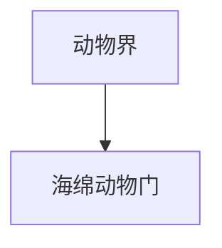

# 海绵动物门

## 范围

海绵动物门属于动物界，是体制较简单的一类多细胞动物。

## 概括

海绵动物多数生活在水中，营固着滤食生活。它们通常缺少真正的组织和器官，是理解动物早期体制分化的重要类群。

## 分类关系

## 说明

- 代表类群包括各种海绵。
- 体壁有水流通道系统，通过水流过滤食物颗粒。
- 与多数后生动物相比，海绵动物的组织分化程度较低。

## 上级

- [动物界](/%E8%87%AA%E7%84%B6%E7%A7%91%E5%AD%A6/%E7%94%9F%E5%91%BD%E7%A7%91%E5%AD%A6/%E7%94%9F%E7%89%A9%E5%88%86%E7%B1%BB%E5%AD%A6/%E5%9F%9F/%E7%9C%9F%E6%A0%B8%E7%94%9F%E7%89%A9%E5%9F%9F/%E5%8A%A8%E7%89%A9%E7%95%8C/README.md)
