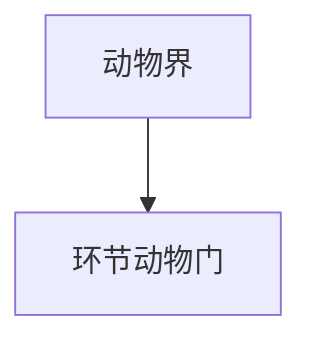

# 环节动物门

## 范围

环节动物门属于动物界，常见代表包括蚯蚓、水蛭和多毛类等。

## 概括

环节动物以身体分节为重要特征，具有较明显的体腔和器官系统。它们生活环境多样，包括土壤、淡水和海洋。

## 分类关系

## 说明

- 蚯蚓常作为陆生环节动物代表。
- 水蛭部分种类以吸血或捕食为生。
- 多毛类多见于海洋环境。

## 上级

- [动物界](/%E8%87%AA%E7%84%B6%E7%A7%91%E5%AD%A6/%E7%94%9F%E5%91%BD%E7%A7%91%E5%AD%A6/%E7%94%9F%E7%89%A9%E5%88%86%E7%B1%BB%E5%AD%A6/%E5%9F%9F/%E7%9C%9F%E6%A0%B8%E7%94%9F%E7%89%A9%E5%9F%9F/%E5%8A%A8%E7%89%A9%E7%95%8C/README.md)
