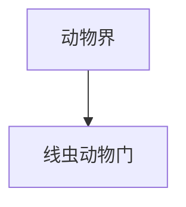

# 线虫动物门

## 范围

线虫动物门属于动物界，常见代表包括蛔虫和秀丽隐杆线虫等。

## 概括

线虫身体细长，通常覆盖角质层，具有假体腔。线虫种类多、分布广，既有自由生活种类，也有植物、动物或人体寄生种类。

## 分类关系

## 说明

- 秀丽隐杆线虫是常用模式生物。
- 蛔虫等寄生线虫与医学、农业和生态学都有关系。
- 线虫与环节动物都可能呈细长体形，但线虫没有环节动物那样明显的体节结构。

## 上级

- [动物界](/%E8%87%AA%E7%84%B6%E7%A7%91%E5%AD%A6/%E7%94%9F%E5%91%BD%E7%A7%91%E5%AD%A6/%E7%94%9F%E7%89%A9%E5%88%86%E7%B1%BB%E5%AD%A6/%E5%9F%9F/%E7%9C%9F%E6%A0%B8%E7%94%9F%E7%89%A9%E5%9F%9F/%E5%8A%A8%E7%89%A9%E7%95%8C/README.md)
