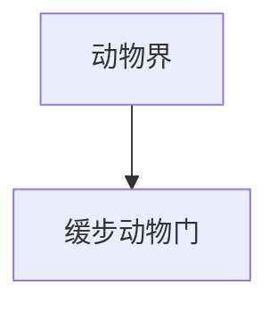

# 缓步动物门

## 范围

缓步动物门属于动物界，常见代表为水熊虫。

## 概括

缓步动物体型微小，具有短足和分节体形，常生活在水膜、苔藓、土壤和水生环境中。它们以极强的环境耐受能力而知名。

## 分类关系

## 说明

- 常被称为水熊虫。
- 在干燥、低温、高辐射等极端条件下可进入高度耐受状态。
- 与节肢动物、线虫等同属蜕皮动物相关讨论中的重要小型类群。

## 上级

- [动物界](/%E8%87%AA%E7%84%B6%E7%A7%91%E5%AD%A6/%E7%94%9F%E5%91%BD%E7%A7%91%E5%AD%A6/%E7%94%9F%E7%89%A9%E5%88%86%E7%B1%BB%E5%AD%A6/%E5%9F%9F/%E7%9C%9F%E6%A0%B8%E7%94%9F%E7%89%A9%E5%9F%9F/%E5%8A%A8%E7%89%A9%E7%95%8C/README.md)
