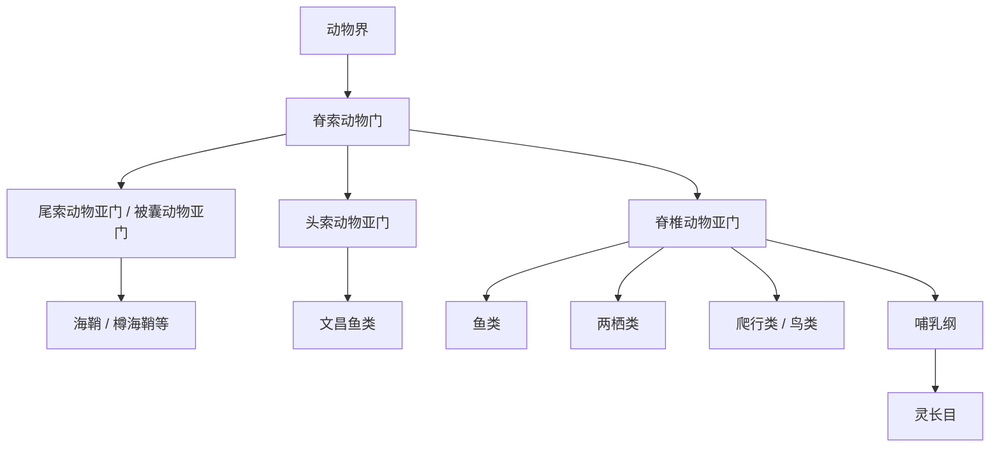

# 脊索动物门

## 范围

脊索动物门属于动物界。典型脊索动物在至少某一发育阶段具有脊索、背神经管、咽裂、肛后尾等特征；脊椎动物是其中最熟悉的分支。

## 概括

脊索动物门通常分为三个亚门：尾索动物亚门、头索动物亚门和脊椎动物亚门。尾索动物和头索动物不具脊椎，常被合称为原索动物；脊椎动物亚门则包括鱼类、两栖类、爬行类、鸟类和哺乳类等。

## 分类关系

## 亚门

| 亚门 | 别名 / 英文 | 代表类群 | 说明 | 链接 |
| --- | --- | --- | --- | --- |
| 尾索动物亚门 | 被囊动物亚门；Tunicata / Urochordata | 海鞘、樽海鞘、尾海鞘 | 多数成体营固着或漂浮生活，幼体常保留典型脊索动物特征 | [尾索动物亚门](/%E8%87%AA%E7%84%B6%E7%A7%91%E5%AD%A6/%E7%94%9F%E5%91%BD%E7%A7%91%E5%AD%A6/%E7%94%9F%E7%89%A9%E5%88%86%E7%B1%BB%E5%AD%A6/%E5%9F%9F/%E7%9C%9F%E6%A0%B8%E7%94%9F%E7%89%A9%E5%9F%9F/%E5%8A%A8%E7%89%A9%E7%95%8C/%E8%84%8A%E7%B4%A2%E5%8A%A8%E7%89%A9%E9%97%A8/%E5%B0%BE%E7%B4%A2%E5%8A%A8%E7%89%A9%E4%BA%9A%E9%97%A8/README.md) |
| 头索动物亚门 | Cephalochordata | 文昌鱼类 | 体形细长，脊索贯穿身体前后，是理解脊索动物基本体制的重要类群 | [头索动物亚门](/%E8%87%AA%E7%84%B6%E7%A7%91%E5%AD%A6/%E7%94%9F%E5%91%BD%E7%A7%91%E5%AD%A6/%E7%94%9F%E7%89%A9%E5%88%86%E7%B1%BB%E5%AD%A6/%E5%9F%9F/%E7%9C%9F%E6%A0%B8%E7%94%9F%E7%89%A9%E5%9F%9F/%E5%8A%A8%E7%89%A9%E7%95%8C/%E8%84%8A%E7%B4%A2%E5%8A%A8%E7%89%A9%E9%97%A8/%E5%A4%B4%E7%B4%A2%E5%8A%A8%E7%89%A9%E4%BA%9A%E9%97%A8/README.md) |
| 脊椎动物亚门 | Vertebrata；有时与 Craniata 近用 | 鱼类、两栖类、爬行类、鸟类、哺乳类 | 具有脊椎或由脊索演化而来的轴骨骼系统，是脊索动物中最熟悉、物种和形态多样性很高的分支 | [脊椎动物亚门](/%E8%87%AA%E7%84%B6%E7%A7%91%E5%AD%A6/%E7%94%9F%E5%91%BD%E7%A7%91%E5%AD%A6/%E7%94%9F%E7%89%A9%E5%88%86%E7%B1%BB%E5%AD%A6/%E5%9F%9F/%E7%9C%9F%E6%A0%B8%E7%94%9F%E7%89%A9%E5%9F%9F/%E5%8A%A8%E7%89%A9%E7%95%8C/%E8%84%8A%E7%B4%A2%E5%8A%A8%E7%89%A9%E9%97%A8/%E8%84%8A%E6%A4%8E%E5%8A%A8%E7%89%A9%E4%BA%9A%E9%97%A8/README.md) |

## 说明

- “原索动物”通常指尾索动物和头索动物的合称，不是与脊椎动物并列的正式单一亚门。
- 尾索动物、头索动物都属于脊索动物，但不属于脊椎动物。
- 半索动物曾在旧体系中与脊索动物关系密切地讨论，但现代分类通常把半索动物门作为独立动物门，不列为脊索动物门的亚门。

## 上级

- [动物界](/%E8%87%AA%E7%84%B6%E7%A7%91%E5%AD%A6/%E7%94%9F%E5%91%BD%E7%A7%91%E5%AD%A6/%E7%94%9F%E7%89%A9%E5%88%86%E7%B1%BB%E5%AD%A6/%E5%9F%9F/%E7%9C%9F%E6%A0%B8%E7%94%9F%E7%89%A9%E5%9F%9F/%E5%8A%A8%E7%89%A9%E7%95%8C/README.md)
