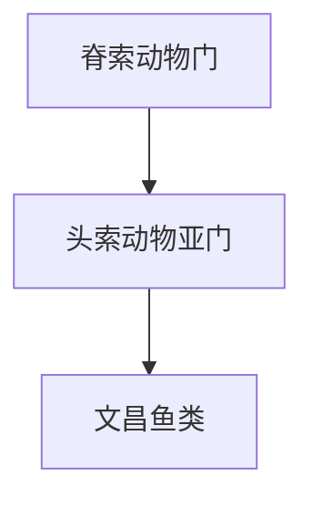

# 头索动物亚门

## 范围

头索动物亚门属于脊索动物门，对应 Cephalochordata，代表类群通常称为文昌鱼类。

## 概括

头索动物体形细长，脊索延伸到身体前部并贯穿身体大部分长度。它们没有真正的头骨和脊椎，是观察脊索动物基本体制的重要类群。

## 分类关系

## 说明

- 头索动物属于脊索动物，但不是脊椎动物。
- 文昌鱼类常被用来比较脊索动物的基础结构，如脊索、背神经管和咽裂。
- 头索动物和尾索动物可合称原索动物，但二者不是同一个亚门。

## 上级

- [脊索动物门](/%E8%87%AA%E7%84%B6%E7%A7%91%E5%AD%A6/%E7%94%9F%E5%91%BD%E7%A7%91%E5%AD%A6/%E7%94%9F%E7%89%A9%E5%88%86%E7%B1%BB%E5%AD%A6/%E5%9F%9F/%E7%9C%9F%E6%A0%B8%E7%94%9F%E7%89%A9%E5%9F%9F/%E5%8A%A8%E7%89%A9%E7%95%8C/%E8%84%8A%E7%B4%A2%E5%8A%A8%E7%89%A9%E9%97%A8/README.md)
