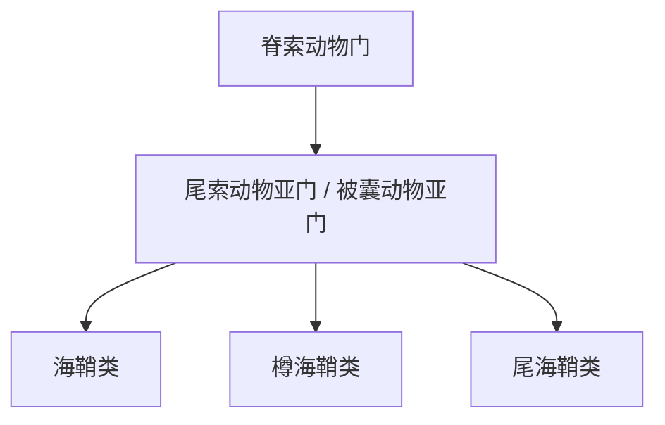

# 尾索动物亚门

## 范围

尾索动物亚门属于脊索动物门，又称被囊动物亚门，对应 Tunicata 或 Urochordata。

## 概括

尾索动物多为海生，代表类群包括海鞘、樽海鞘和尾海鞘等。许多尾索动物的幼体保留脊索、背神经管和尾部等典型脊索动物特征，而成体形态常发生明显变化。

## 分类关系

## 说明

- 尾索动物属于脊索动物，但不是脊椎动物。
- “被囊动物”名称来自其体表常有囊状外被。
- 幼体和成体形态差异明显，是理解脊索动物特征在发育阶段中保留或退化的典型材料。

## 上级

- [脊索动物门](/%E8%87%AA%E7%84%B6%E7%A7%91%E5%AD%A6/%E7%94%9F%E5%91%BD%E7%A7%91%E5%AD%A6/%E7%94%9F%E7%89%A9%E5%88%86%E7%B1%BB%E5%AD%A6/%E5%9F%9F/%E7%9C%9F%E6%A0%B8%E7%94%9F%E7%89%A9%E5%9F%9F/%E5%8A%A8%E7%89%A9%E7%95%8C/%E8%84%8A%E7%B4%A2%E5%8A%A8%E7%89%A9%E9%97%A8/README.md)
