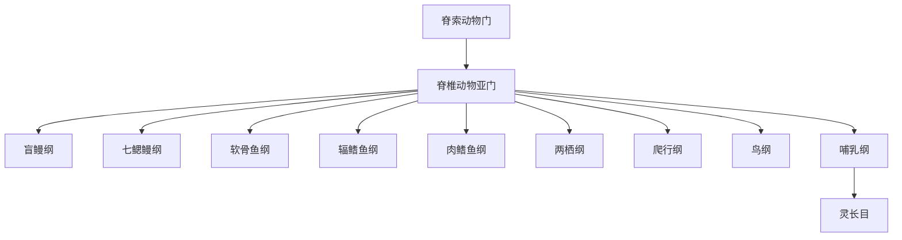

# 脊椎动物亚门

## 范围

脊椎动物亚门属于脊索动物门，对应 Vertebrata。它包括无颌类、有颌鱼类、两栖类、爬行类、鸟类和哺乳类等动物。

## 概括

脊椎动物是脊索动物门中最熟悉的亚门。其共同特征包括头部和感觉器官较发达，具有由脊索演化而来的轴向支撑结构，通常有脊椎或类似的内骨骼系统。不同分类体系对无颌类和硬骨鱼类的纲级拆分不同；本目录采用便于学习和继续扩展的现生主干纲级入口。

## 分类关系

## 主要纲

| 纲 | 英文 / 拉丁名 | 常见代表 | 说明 | 链接 |
| --- | --- | --- | --- | --- |
| 盲鳗纲 | Myxini | 盲鳗 | 无颌类，身体细长，缺少真正颌，常与七鳃鳗合称圆口类 | [盲鳗纲](/%E8%87%AA%E7%84%B6%E7%A7%91%E5%AD%A6/%E7%94%9F%E5%91%BD%E7%A7%91%E5%AD%A6/%E7%94%9F%E7%89%A9%E5%88%86%E7%B1%BB%E5%AD%A6/%E5%9F%9F/%E7%9C%9F%E6%A0%B8%E7%94%9F%E7%89%A9%E5%9F%9F/%E5%8A%A8%E7%89%A9%E7%95%8C/%E8%84%8A%E7%B4%A2%E5%8A%A8%E7%89%A9%E9%97%A8/%E8%84%8A%E6%A4%8E%E5%8A%A8%E7%89%A9%E4%BA%9A%E9%97%A8/%E7%9B%B2%E9%B3%97%E7%BA%B2/README.md) |
| 七鳃鳗纲 | Petromyzonti | 七鳃鳗 | 无颌类，口部常呈吸盘状，部分种类营寄生生活 | [七鳃鳗纲](/%E8%87%AA%E7%84%B6%E7%A7%91%E5%AD%A6/%E7%94%9F%E5%91%BD%E7%A7%91%E5%AD%A6/%E7%94%9F%E7%89%A9%E5%88%86%E7%B1%BB%E5%AD%A6/%E5%9F%9F/%E7%9C%9F%E6%A0%B8%E7%94%9F%E7%89%A9%E5%9F%9F/%E5%8A%A8%E7%89%A9%E7%95%8C/%E8%84%8A%E7%B4%A2%E5%8A%A8%E7%89%A9%E9%97%A8/%E8%84%8A%E6%A4%8E%E5%8A%A8%E7%89%A9%E4%BA%9A%E9%97%A8/%E4%B8%83%E9%B3%83%E9%B3%97%E7%BA%B2/README.md) |
| 软骨鱼纲 | Chondrichthyes | 鲨、鳐、魟、银鲛 | 有颌鱼类，骨骼主要为软骨 | [软骨鱼纲](/%E8%87%AA%E7%84%B6%E7%A7%91%E5%AD%A6/%E7%94%9F%E5%91%BD%E7%A7%91%E5%AD%A6/%E7%94%9F%E7%89%A9%E5%88%86%E7%B1%BB%E5%AD%A6/%E5%9F%9F/%E7%9C%9F%E6%A0%B8%E7%94%9F%E7%89%A9%E5%9F%9F/%E5%8A%A8%E7%89%A9%E7%95%8C/%E8%84%8A%E7%B4%A2%E5%8A%A8%E7%89%A9%E9%97%A8/%E8%84%8A%E6%A4%8E%E5%8A%A8%E7%89%A9%E4%BA%9A%E9%97%A8/%E8%BD%AF%E9%AA%A8%E9%B1%BC%E7%BA%B2/README.md) |
| 辐鳍鱼纲 | Actinopterygii | 大多数常见硬骨鱼 | 鳍由鳍条支撑，是现生鱼类中物种最多的一支 | [辐鳍鱼纲](/%E8%87%AA%E7%84%B6%E7%A7%91%E5%AD%A6/%E7%94%9F%E5%91%BD%E7%A7%91%E5%AD%A6/%E7%94%9F%E7%89%A9%E5%88%86%E7%B1%BB%E5%AD%A6/%E5%9F%9F/%E7%9C%9F%E6%A0%B8%E7%94%9F%E7%89%A9%E5%9F%9F/%E5%8A%A8%E7%89%A9%E7%95%8C/%E8%84%8A%E7%B4%A2%E5%8A%A8%E7%89%A9%E9%97%A8/%E8%84%8A%E6%A4%8E%E5%8A%A8%E7%89%A9%E4%BA%9A%E9%97%A8/%E8%BE%90%E9%B3%8D%E9%B1%BC%E7%BA%B2/README.md) |
| 肉鳍鱼纲 | Sarcopterygii | 肺鱼、腔棘鱼 | 具有肉质叶状偶鳍；四足动物的祖先谱系与这一支关系密切 | [肉鳍鱼纲](/%E8%87%AA%E7%84%B6%E7%A7%91%E5%AD%A6/%E7%94%9F%E5%91%BD%E7%A7%91%E5%AD%A6/%E7%94%9F%E7%89%A9%E5%88%86%E7%B1%BB%E5%AD%A6/%E5%9F%9F/%E7%9C%9F%E6%A0%B8%E7%94%9F%E7%89%A9%E5%9F%9F/%E5%8A%A8%E7%89%A9%E7%95%8C/%E8%84%8A%E7%B4%A2%E5%8A%A8%E7%89%A9%E9%97%A8/%E8%84%8A%E6%A4%8E%E5%8A%A8%E7%89%A9%E4%BA%9A%E9%97%A8/%E8%82%89%E9%B3%8D%E9%B1%BC%E7%BA%B2/README.md) |
| 两栖纲 | Amphibia | 蛙、蟾蜍、蝾螈、蚓螈 | 多数生活史与水陆两种环境相关，皮肤湿润，常有变态发育 | [两栖纲](/%E8%87%AA%E7%84%B6%E7%A7%91%E5%AD%A6/%E7%94%9F%E5%91%BD%E7%A7%91%E5%AD%A6/%E7%94%9F%E7%89%A9%E5%88%86%E7%B1%BB%E5%AD%A6/%E5%9F%9F/%E7%9C%9F%E6%A0%B8%E7%94%9F%E7%89%A9%E5%9F%9F/%E5%8A%A8%E7%89%A9%E7%95%8C/%E8%84%8A%E7%B4%A2%E5%8A%A8%E7%89%A9%E9%97%A8/%E8%84%8A%E6%A4%8E%E5%8A%A8%E7%89%A9%E4%BA%9A%E9%97%A8/%E4%B8%A4%E6%A0%96%E7%BA%B2/README.md) |
| 爬行纲 | Reptilia | 龟、蜥蜴、蛇、鳄 | 传统分类中的羊膜动物类群；若按严格系统发育，鸟类嵌套在爬行动物谱系内 | [爬行纲](/%E8%87%AA%E7%84%B6%E7%A7%91%E5%AD%A6/%E7%94%9F%E5%91%BD%E7%A7%91%E5%AD%A6/%E7%94%9F%E7%89%A9%E5%88%86%E7%B1%BB%E5%AD%A6/%E5%9F%9F/%E7%9C%9F%E6%A0%B8%E7%94%9F%E7%89%A9%E5%9F%9F/%E5%8A%A8%E7%89%A9%E7%95%8C/%E8%84%8A%E7%B4%A2%E5%8A%A8%E7%89%A9%E9%97%A8/%E8%84%8A%E6%A4%8E%E5%8A%A8%E7%89%A9%E4%BA%9A%E9%97%A8/%E7%88%AC%E8%A1%8C%E7%BA%B2/README.md) |
| 鸟纲 | Aves | 鸟类 | 具羽毛、喙和高度特化的飞行或行走适应；演化上来自兽脚类恐龙 | [鸟纲](/%E8%87%AA%E7%84%B6%E7%A7%91%E5%AD%A6/%E7%94%9F%E5%91%BD%E7%A7%91%E5%AD%A6/%E7%94%9F%E7%89%A9%E5%88%86%E7%B1%BB%E5%AD%A6/%E5%9F%9F/%E7%9C%9F%E6%A0%B8%E7%94%9F%E7%89%A9%E5%9F%9F/%E5%8A%A8%E7%89%A9%E7%95%8C/%E8%84%8A%E7%B4%A2%E5%8A%A8%E7%89%A9%E9%97%A8/%E8%84%8A%E6%A4%8E%E5%8A%A8%E7%89%A9%E4%BA%9A%E9%97%A8/%E9%B8%9F%E7%BA%B2/README.md) |
| 哺乳纲 | Mammalia | 单孔类、有袋类、胎盘类 | 以乳腺、毛发、恒温和较发达神经系统等特征为代表 | [哺乳纲](/%E8%87%AA%E7%84%B6%E7%A7%91%E5%AD%A6/%E7%94%9F%E5%91%BD%E7%A7%91%E5%AD%A6/%E7%94%9F%E7%89%A9%E5%88%86%E7%B1%BB%E5%AD%A6/%E5%9F%9F/%E7%9C%9F%E6%A0%B8%E7%94%9F%E7%89%A9%E5%9F%9F/%E5%8A%A8%E7%89%A9%E7%95%8C/%E8%84%8A%E7%B4%A2%E5%8A%A8%E7%89%A9%E9%97%A8/%E8%84%8A%E6%A4%8E%E5%8A%A8%E7%89%A9%E4%BA%9A%E9%97%A8/%E5%93%BA%E4%B9%B3%E7%BA%B2/README.md) |

## 说明

- “鱼类”不是一个严格单一的纲，本目录把常见鱼类入口拆成盲鳗纲、七鳃鳗纲、软骨鱼纲、辐鳍鱼纲和肉鳍鱼纲。
- 传统的“爬行纲”若排除鸟类，会是并系类群；作为学习目录仍可保留，但应知道鸟类在演化上来自爬行动物谱系。
- 不同资料可能把盲鳗和七鳃鳗合并为圆口纲，或把辐鳍鱼、肉鳍鱼放在硬骨鱼类下作不同层级处理。

## 上级

- [脊索动物门](/%E8%87%AA%E7%84%B6%E7%A7%91%E5%AD%A6/%E7%94%9F%E5%91%BD%E7%A7%91%E5%AD%A6/%E7%94%9F%E7%89%A9%E5%88%86%E7%B1%BB%E5%AD%A6/%E5%9F%9F/%E7%9C%9F%E6%A0%B8%E7%94%9F%E7%89%A9%E5%9F%9F/%E5%8A%A8%E7%89%A9%E7%95%8C/%E8%84%8A%E7%B4%A2%E5%8A%A8%E7%89%A9%E9%97%A8/README.md)
