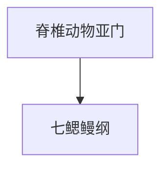

# 七鳃鳗纲

## 范围

七鳃鳗纲属于脊椎动物亚门，是现生无颌类脊椎动物的一支。

## 概括

七鳃鳗身体细长，缺少真正颌，口部常呈吸盘状。部分种类营寄生生活，也有非寄生类型。

## 分类关系

## 说明

- 七鳃鳗与盲鳗常被合称为圆口类。
- 七鳃鳗是理解无颌脊椎动物和有颌脊椎动物差异的重要类群。
- 与盲鳗相比，七鳃鳗在一些结构上更接近传统意义的脊椎动物。

## 上级

- [脊椎动物亚门](/%E8%87%AA%E7%84%B6%E7%A7%91%E5%AD%A6/%E7%94%9F%E5%91%BD%E7%A7%91%E5%AD%A6/%E7%94%9F%E7%89%A9%E5%88%86%E7%B1%BB%E5%AD%A6/%E5%9F%9F/%E7%9C%9F%E6%A0%B8%E7%94%9F%E7%89%A9%E5%9F%9F/%E5%8A%A8%E7%89%A9%E7%95%8C/%E8%84%8A%E7%B4%A2%E5%8A%A8%E7%89%A9%E9%97%A8/%E8%84%8A%E6%A4%8E%E5%8A%A8%E7%89%A9%E4%BA%9A%E9%97%A8/README.md)
