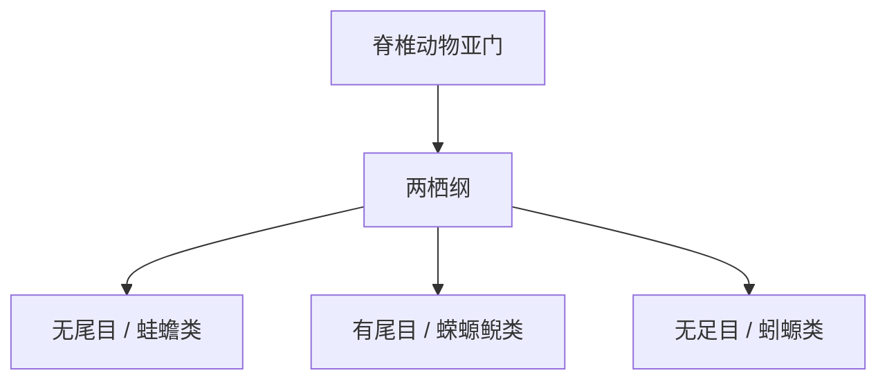

# 两栖纲

## 范围

两栖纲属于脊椎动物亚门，是四足动物中较早适应陆地环境的一支。

## 概括

两栖纲包括蛙、蟾蜍、蝾螈、鲵和蚓螈等。许多两栖动物生活史同时依赖水域和陆地环境，幼体常水生，成体可陆生或半水生。

## 分类关系

## 说明

- 两栖动物皮肤通常较湿润，许多种类需要水环境繁殖。
- 变态发育是许多两栖动物的重要生活史特征。
- 两栖纲与爬行纲、鸟纲、哺乳纲同属四足动物相关讨论，但两栖动物不属于羊膜动物。

## 上级

- [脊椎动物亚门](/%E8%87%AA%E7%84%B6%E7%A7%91%E5%AD%A6/%E7%94%9F%E5%91%BD%E7%A7%91%E5%AD%A6/%E7%94%9F%E7%89%A9%E5%88%86%E7%B1%BB%E5%AD%A6/%E5%9F%9F/%E7%9C%9F%E6%A0%B8%E7%94%9F%E7%89%A9%E5%9F%9F/%E5%8A%A8%E7%89%A9%E7%95%8C/%E8%84%8A%E7%B4%A2%E5%8A%A8%E7%89%A9%E9%97%A8/%E8%84%8A%E6%A4%8E%E5%8A%A8%E7%89%A9%E4%BA%9A%E9%97%A8/README.md)
