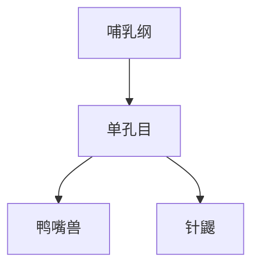

# 单孔目

## 范围

单孔目属于哺乳纲，是现生原兽类的代表目。

## 概括

单孔目包括鸭嘴兽和针鼹等卵生哺乳动物。它们具有哺乳动物的乳腺和毛发等特征，但繁殖方式保留卵生特点。

## 分类关系

## 说明

- 单孔目不是有袋类，也不是胎盘类。
- “单孔”指泄殖腔开口结构，与其繁殖和排泄系统有关。

## 上级

- [哺乳纲](/%E8%87%AA%E7%84%B6%E7%A7%91%E5%AD%A6/%E7%94%9F%E5%91%BD%E7%A7%91%E5%AD%A6/%E7%94%9F%E7%89%A9%E5%88%86%E7%B1%BB%E5%AD%A6/%E5%9F%9F/%E7%9C%9F%E6%A0%B8%E7%94%9F%E7%89%A9%E5%9F%9F/%E5%8A%A8%E7%89%A9%E7%95%8C/%E8%84%8A%E7%B4%A2%E5%8A%A8%E7%89%A9%E9%97%A8/%E8%84%8A%E6%A4%8E%E5%8A%A8%E7%89%A9%E4%BA%9A%E9%97%A8/%E5%93%BA%E4%B9%B3%E7%BA%B2/README.md)
