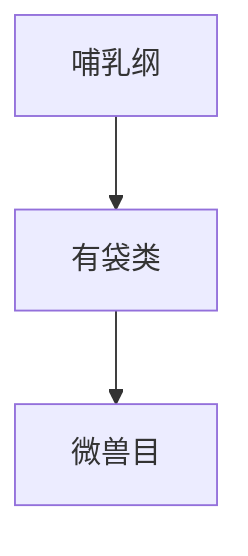

# 微兽目

## 范围

微兽目属于哺乳纲、有袋类。

## 概括

微兽目是现生有袋类中的小型类群，代表为山猴负鼠。虽然现生种类很少，但在理解南美有袋类和澳洲有袋类关系时有重要意义。

## 分类关系

## 说明

- 代表类群为山猴负鼠。
- 微兽目名称中的“微兽”是分类名，不表示所有个体都极小。

## 上级

- [哺乳纲](/%E8%87%AA%E7%84%B6%E7%A7%91%E5%AD%A6/%E7%94%9F%E5%91%BD%E7%A7%91%E5%AD%A6/%E7%94%9F%E7%89%A9%E5%88%86%E7%B1%BB%E5%AD%A6/%E5%9F%9F/%E7%9C%9F%E6%A0%B8%E7%94%9F%E7%89%A9%E5%9F%9F/%E5%8A%A8%E7%89%A9%E7%95%8C/%E8%84%8A%E7%B4%A2%E5%8A%A8%E7%89%A9%E9%97%A8/%E8%84%8A%E6%A4%8E%E5%8A%A8%E7%89%A9%E4%BA%9A%E9%97%A8/%E5%93%BA%E4%B9%B3%E7%BA%B2/README.md)
