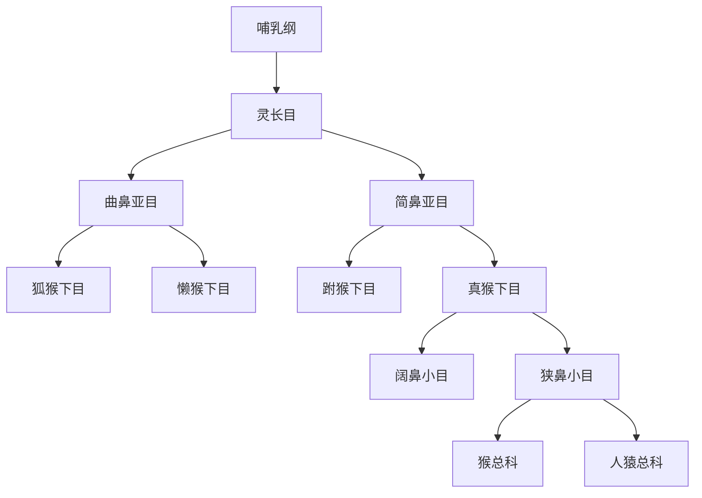

# 灵长目

## 范围

灵长目属于哺乳纲、胎盘类，是以视觉、抓握能力、较发达脑部和复杂社会行为为重要特征的哺乳动物类群。本目录按现代常见系统分类整理到亚目、下目、小目、总科、科、亚科、族、亚族和属级节点。

## 概括

灵长目通常分为曲鼻亚目和简鼻亚目。曲鼻亚目包括狐猴类和懒猴类；简鼻亚目包括跗猴类和真猴类。真猴类再分为阔鼻小目和狭鼻小目，狭鼻小目下包含猴总科和人猿总科；人猿总科下再整理长臂猿科、人科及其内部属级节点。

## 分类关系

## 子层级

| 层级 | 下级 | 说明 | 链接 |
| --- | --- | --- | --- |
| 曲鼻亚目 | 狐猴下目、懒猴下目 | 保留较多原始灵长类特征，嗅觉作用相对明显 | [曲鼻亚目](/%E8%87%AA%E7%84%B6%E7%A7%91%E5%AD%A6/%E7%94%9F%E5%91%BD%E7%A7%91%E5%AD%A6/%E7%94%9F%E7%89%A9%E5%88%86%E7%B1%BB%E5%AD%A6/%E5%9F%9F/%E7%9C%9F%E6%A0%B8%E7%94%9F%E7%89%A9%E5%9F%9F/%E5%8A%A8%E7%89%A9%E7%95%8C/%E8%84%8A%E7%B4%A2%E5%8A%A8%E7%89%A9%E9%97%A8/%E8%84%8A%E6%A4%8E%E5%8A%A8%E7%89%A9%E4%BA%9A%E9%97%A8/%E5%93%BA%E4%B9%B3%E7%BA%B2/%E7%81%B5%E9%95%BF%E7%9B%AE/%E6%9B%B2%E9%BC%BB%E4%BA%9A%E7%9B%AE/README.md) |
| 简鼻亚目 | 跗猴下目、真猴下目 | 视觉和脑部发育更突出，包含猴类、猿类和人类 | [简鼻亚目](/%E8%87%AA%E7%84%B6%E7%A7%91%E5%AD%A6/%E7%94%9F%E5%91%BD%E7%A7%91%E5%AD%A6/%E7%94%9F%E7%89%A9%E5%88%86%E7%B1%BB%E5%AD%A6/%E5%9F%9F/%E7%9C%9F%E6%A0%B8%E7%94%9F%E7%89%A9%E5%9F%9F/%E5%8A%A8%E7%89%A9%E7%95%8C/%E8%84%8A%E7%B4%A2%E5%8A%A8%E7%89%A9%E9%97%A8/%E8%84%8A%E6%A4%8E%E5%8A%A8%E7%89%A9%E4%BA%9A%E9%97%A8/%E5%93%BA%E4%B9%B3%E7%BA%B2/%E7%81%B5%E9%95%BF%E7%9B%AE/%E7%AE%80%E9%BC%BB%E4%BA%9A%E7%9B%AE/README.md) |
| 人猿总科 | 长臂猿科、人科 | 猿类和人类所在的主干分支 | [人猿总科](/%E8%87%AA%E7%84%B6%E7%A7%91%E5%AD%A6/%E7%94%9F%E5%91%BD%E7%A7%91%E5%AD%A6/%E7%94%9F%E7%89%A9%E5%88%86%E7%B1%BB%E5%AD%A6/%E5%9F%9F/%E7%9C%9F%E6%A0%B8%E7%94%9F%E7%89%A9%E5%9F%9F/%E5%8A%A8%E7%89%A9%E7%95%8C/%E8%84%8A%E7%B4%A2%E5%8A%A8%E7%89%A9%E9%97%A8/%E8%84%8A%E6%A4%8E%E5%8A%A8%E7%89%A9%E4%BA%9A%E9%97%A8/%E5%93%BA%E4%B9%B3%E7%BA%B2/%E7%81%B5%E9%95%BF%E7%9B%AE/%E7%AE%80%E9%BC%BB%E4%BA%9A%E7%9B%AE/%E7%9C%9F%E7%8C%B4%E4%B8%8B%E7%9B%AE/%E7%8B%AD%E9%BC%BB%E5%B0%8F%E7%9B%AE/%E4%BA%BA%E7%8C%BF%E6%80%BB%E7%A7%91/README.md) |

## 说明

- “人科”在现代系统分类中通常不是只指人类，而是包括人类及大型猿类。
- “人属”中的古人类名称并非都具有同等稳定的分类地位；有些是物种，有些是化石材料或候选分类单元。
- 本目录使用层级目录表达分类关系；总览页只保留主线和导航，细节事实放入下级 README。

## 上级

- [哺乳纲](/%E8%87%AA%E7%84%B6%E7%A7%91%E5%AD%A6/%E7%94%9F%E5%91%BD%E7%A7%91%E5%AD%A6/%E7%94%9F%E7%89%A9%E5%88%86%E7%B1%BB%E5%AD%A6/%E5%9F%9F/%E7%9C%9F%E6%A0%B8%E7%94%9F%E7%89%A9%E5%9F%9F/%E5%8A%A8%E7%89%A9%E7%95%8C/%E8%84%8A%E7%B4%A2%E5%8A%A8%E7%89%A9%E9%97%A8/%E8%84%8A%E6%A4%8E%E5%8A%A8%E7%89%A9%E4%BA%9A%E9%97%A8/%E5%93%BA%E4%B9%B3%E7%BA%B2/README.md)
