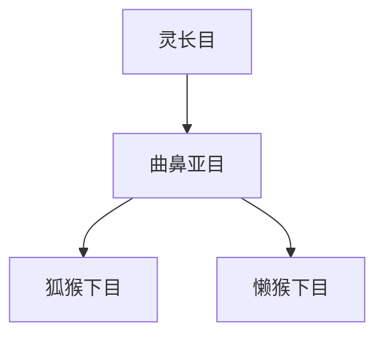

# 曲鼻亚目

## 范围

曲鼻亚目是灵长目下的主要亚目之一，通常包括狐猴类、懒猴类和婴猴类等类群。

## 概括

曲鼻亚目相对保留较多早期灵长类特征，嗅觉作用较突出，许多类群具有湿润鼻端。现生代表主要分布在马达加斯加、非洲和亚洲热带地区。

## 分类关系

## 子层级

| 下目 | 代表 | 说明 |
| --- | --- | --- |
| 狐猴下目 | 狐猴、指猴、鼬狐猴、大狐猴 | 主要与马达加斯加灵长类有关 |
| 懒猴下目 | 懒猴、婴猴 | 非洲和亚洲的夜行或树栖小型灵长类 |

## 上级

- [灵长目](/%E8%87%AA%E7%84%B6%E7%A7%91%E5%AD%A6/%E7%94%9F%E5%91%BD%E7%A7%91%E5%AD%A6/%E7%94%9F%E7%89%A9%E5%88%86%E7%B1%BB%E5%AD%A6/%E5%9F%9F/%E7%9C%9F%E6%A0%B8%E7%94%9F%E7%89%A9%E5%9F%9F/%E5%8A%A8%E7%89%A9%E7%95%8C/%E8%84%8A%E7%B4%A2%E5%8A%A8%E7%89%A9%E9%97%A8/%E8%84%8A%E6%A4%8E%E5%8A%A8%E7%89%A9%E4%BA%9A%E9%97%A8/%E5%93%BA%E4%B9%B3%E7%BA%B2/%E7%81%B5%E9%95%BF%E7%9B%AE/README.md)
