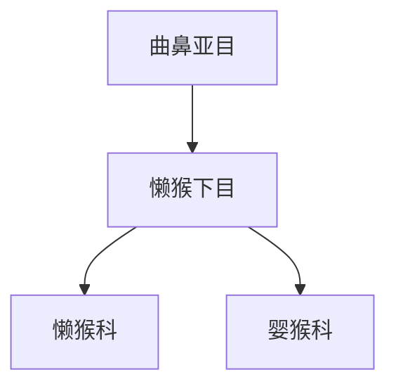

# 懒猴下目

## 范围

懒猴下目属于曲鼻亚目，通常包括懒猴科和婴猴科。

## 概括

懒猴下目多为夜行性树栖灵长类。懒猴类常行动缓慢，婴猴类则跳跃能力强，两者都保留较明显的夜行适应。

## 分类关系

## 说明

- 懒猴科包括懒猴、蜂猴、丛猴等常见中文名所指类群。
- 婴猴科主要分布于非洲，弹跳和夜间活动能力突出。

## 上级

- [曲鼻亚目](/%E8%87%AA%E7%84%B6%E7%A7%91%E5%AD%A6/%E7%94%9F%E5%91%BD%E7%A7%91%E5%AD%A6/%E7%94%9F%E7%89%A9%E5%88%86%E7%B1%BB%E5%AD%A6/%E5%9F%9F/%E7%9C%9F%E6%A0%B8%E7%94%9F%E7%89%A9%E5%9F%9F/%E5%8A%A8%E7%89%A9%E7%95%8C/%E8%84%8A%E7%B4%A2%E5%8A%A8%E7%89%A9%E9%97%A8/%E8%84%8A%E6%A4%8E%E5%8A%A8%E7%89%A9%E4%BA%9A%E9%97%A8/%E5%93%BA%E4%B9%B3%E7%BA%B2/%E7%81%B5%E9%95%BF%E7%9B%AE/%E6%9B%B2%E9%BC%BB%E4%BA%9A%E7%9B%AE/README.md)
