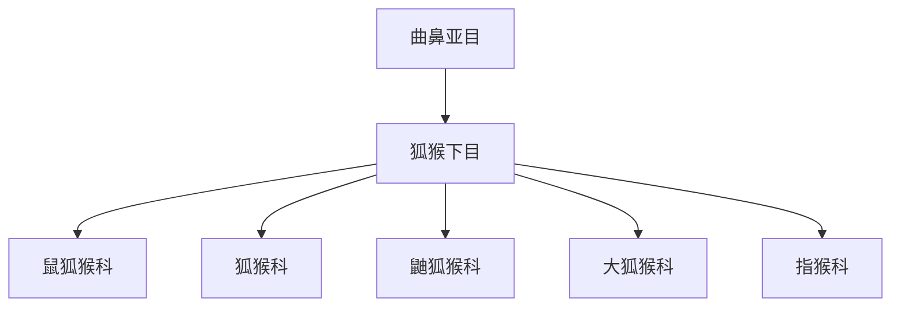

# 狐猴下目

## 范围

狐猴下目属于曲鼻亚目，主要整理马达加斯加灵长类及其近缘类群。

## 概括

狐猴下目常包括狐猴科、鼬狐猴科、大狐猴科、鼠狐猴科和指猴科等。它们多为树栖或半树栖，体型、食性和活动节律差异很大。

## 分类关系

## 说明

- 狐猴类的多样化与马达加斯加长期隔离有关。
- 指猴形态特殊，常作为狐猴类中辨识度很高的分支。

## 上级

- [曲鼻亚目](/%E8%87%AA%E7%84%B6%E7%A7%91%E5%AD%A6/%E7%94%9F%E5%91%BD%E7%A7%91%E5%AD%A6/%E7%94%9F%E7%89%A9%E5%88%86%E7%B1%BB%E5%AD%A6/%E5%9F%9F/%E7%9C%9F%E6%A0%B8%E7%94%9F%E7%89%A9%E5%9F%9F/%E5%8A%A8%E7%89%A9%E7%95%8C/%E8%84%8A%E7%B4%A2%E5%8A%A8%E7%89%A9%E9%97%A8/%E8%84%8A%E6%A4%8E%E5%8A%A8%E7%89%A9%E4%BA%9A%E9%97%A8/%E5%93%BA%E4%B9%B3%E7%BA%B2/%E7%81%B5%E9%95%BF%E7%9B%AE/%E6%9B%B2%E9%BC%BB%E4%BA%9A%E7%9B%AE/README.md)
