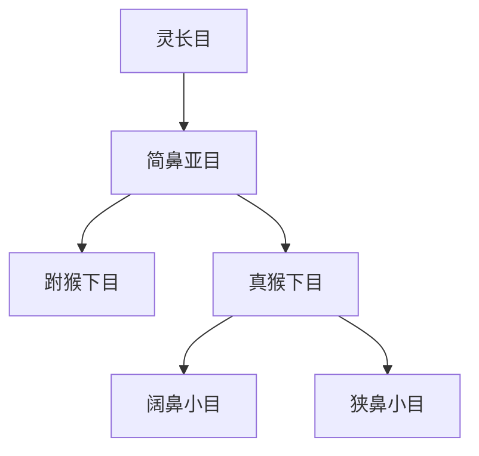

# 简鼻亚目

## 范围

简鼻亚目是灵长目下的主要亚目之一，包括跗猴类和真猴类，后者包含猴类、猿类和人类。

## 概括

简鼻亚目的视觉系统和脑部发育较突出，鼻端不像曲鼻亚目那样保留湿润鼻镜。真猴下目是简鼻亚目中物种和形态多样性很高的分支。

## 分类关系

## 子层级

| 下目 | 下级 | 说明 |
| --- | --- | --- |
| 跗猴下目 | 跗猴科 | 体型小，眼大，夜行性特征明显 |
| 真猴下目 | 阔鼻小目、狭鼻小目 | 包括新大陆猴、旧大陆猴、猿类和人类 |

## 上级

- [灵长目](/%E8%87%AA%E7%84%B6%E7%A7%91%E5%AD%A6/%E7%94%9F%E5%91%BD%E7%A7%91%E5%AD%A6/%E7%94%9F%E7%89%A9%E5%88%86%E7%B1%BB%E5%AD%A6/%E5%9F%9F/%E7%9C%9F%E6%A0%B8%E7%94%9F%E7%89%A9%E5%9F%9F/%E5%8A%A8%E7%89%A9%E7%95%8C/%E8%84%8A%E7%B4%A2%E5%8A%A8%E7%89%A9%E9%97%A8/%E8%84%8A%E6%A4%8E%E5%8A%A8%E7%89%A9%E4%BA%9A%E9%97%A8/%E5%93%BA%E4%B9%B3%E7%BA%B2/%E7%81%B5%E9%95%BF%E7%9B%AE/README.md)
