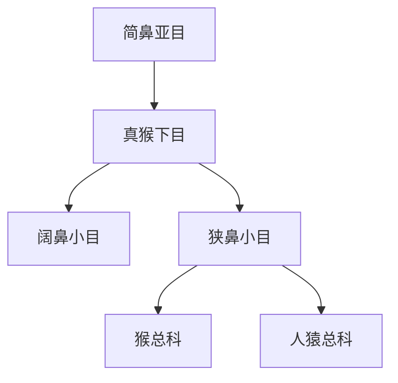

# 真猴下目

## 范围

真猴下目属于简鼻亚目，包括新大陆猴、旧大陆猴、猿类和人类。

## 概括

真猴下目通常分为阔鼻小目和狭鼻小目。阔鼻小目主要对应美洲新大陆猴；狭鼻小目包括旧大陆猴和人猿类，是人类所在的主干分支。

## 分类关系

## 子层级

| 小目 | 下级 | 说明 |
| --- | --- | --- |
| 阔鼻小目 | 卷尾猴科、蜘蛛猴科、僧面猴科等 | 新大陆猴，主要分布于中南美洲 |
| 狭鼻小目 | 猴总科、人猿总科 | 旧大陆猴、猿类和人类所在分支 |

## 上级

- [简鼻亚目](/%E8%87%AA%E7%84%B6%E7%A7%91%E5%AD%A6/%E7%94%9F%E5%91%BD%E7%A7%91%E5%AD%A6/%E7%94%9F%E7%89%A9%E5%88%86%E7%B1%BB%E5%AD%A6/%E5%9F%9F/%E7%9C%9F%E6%A0%B8%E7%94%9F%E7%89%A9%E5%9F%9F/%E5%8A%A8%E7%89%A9%E7%95%8C/%E8%84%8A%E7%B4%A2%E5%8A%A8%E7%89%A9%E9%97%A8/%E8%84%8A%E6%A4%8E%E5%8A%A8%E7%89%A9%E4%BA%9A%E9%97%A8/%E5%93%BA%E4%B9%B3%E7%BA%B2/%E7%81%B5%E9%95%BF%E7%9B%AE/%E7%AE%80%E9%BC%BB%E4%BA%9A%E7%9B%AE/README.md)
