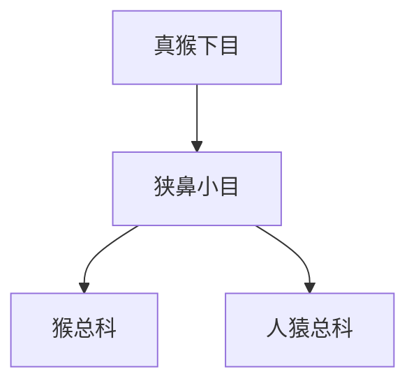

# 狭鼻小目

## 范围

狭鼻小目属于真猴下目，包括旧大陆猴、猿类和人类。

## 概括

狭鼻小目通常分为猴总科和人猿总科。猴总科主要是旧大陆猴；人猿总科包括长臂猿科和人科，人科下再包含猩猩、大猩猩、黑猩猩、人类及其近缘类群。

## 分类关系

## 子层级

| 总科 | 下级 | 说明 |
| --- | --- | --- |
| 猴总科 | 猴科 | 旧大陆猴类，包含猕猴、狒狒、疣猴等类群 |
| 人猿总科 | 长臂猿科、人科 | 猿类和人类所在分支 |

## 上级

- [真猴下目](/%E8%87%AA%E7%84%B6%E7%A7%91%E5%AD%A6/%E7%94%9F%E5%91%BD%E7%A7%91%E5%AD%A6/%E7%94%9F%E7%89%A9%E5%88%86%E7%B1%BB%E5%AD%A6/%E5%9F%9F/%E7%9C%9F%E6%A0%B8%E7%94%9F%E7%89%A9%E5%9F%9F/%E5%8A%A8%E7%89%A9%E7%95%8C/%E8%84%8A%E7%B4%A2%E5%8A%A8%E7%89%A9%E9%97%A8/%E8%84%8A%E6%A4%8E%E5%8A%A8%E7%89%A9%E4%BA%9A%E9%97%A8/%E5%93%BA%E4%B9%B3%E7%BA%B2/%E7%81%B5%E9%95%BF%E7%9B%AE/%E7%AE%80%E9%BC%BB%E4%BA%9A%E7%9B%AE/%E7%9C%9F%E7%8C%B4%E4%B8%8B%E7%9B%AE/README.md)
