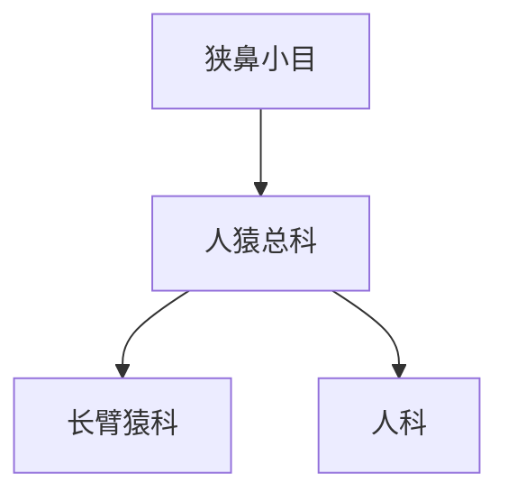

# 人猿总科

## 范围

人猿总科属于狭鼻小目，包含长臂猿科和人科。

## 概括

人猿总科包含小型猿类和大型猿类两条主要现生分支。长臂猿科为小型猿类；人科在现代分类中通常包括人类、黑猩猩、倭黑猩猩、大猩猩和猩猩等大型猿类。

## 分类关系

## 子层级

| 类群 | 下级 | 说明 |
| --- | --- | --- |
| 长臂猿科 | 长臂猿属、白眉长臂猿属、黑冠长臂猿属、合趾猿属 | 小型猿类，与人科并列 |
| 人科 | 人亚科、猩猩亚科 | 现代资料中常包含人类和大型猿类；旧称或俗称中有时写作“猩猩科” |

## 说明

- 人猿总科现生类群通常无尾，肩带和上肢活动能力较强。
- 本页概括人猿总科层级，具体属和物种清单放入人科及其下级节点。

## 上级

- [狭鼻小目](/%E8%87%AA%E7%84%B6%E7%A7%91%E5%AD%A6/%E7%94%9F%E5%91%BD%E7%A7%91%E5%AD%A6/%E7%94%9F%E7%89%A9%E5%88%86%E7%B1%BB%E5%AD%A6/%E5%9F%9F/%E7%9C%9F%E6%A0%B8%E7%94%9F%E7%89%A9%E5%9F%9F/%E5%8A%A8%E7%89%A9%E7%95%8C/%E8%84%8A%E7%B4%A2%E5%8A%A8%E7%89%A9%E9%97%A8/%E8%84%8A%E6%A4%8E%E5%8A%A8%E7%89%A9%E4%BA%9A%E9%97%A8/%E5%93%BA%E4%B9%B3%E7%BA%B2/%E7%81%B5%E9%95%BF%E7%9B%AE/%E7%AE%80%E9%BC%BB%E4%BA%9A%E7%9B%AE/%E7%9C%9F%E7%8C%B4%E4%B8%8B%E7%9B%AE/%E7%8B%AD%E9%BC%BB%E5%B0%8F%E7%9B%AE/README.md)
