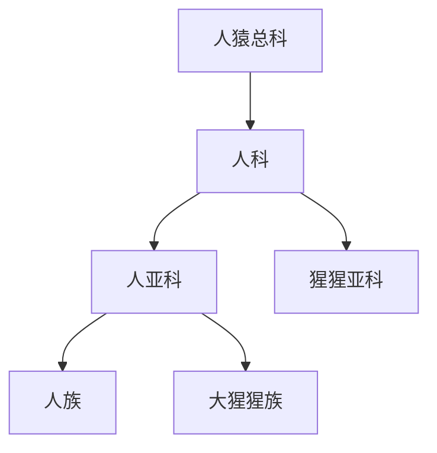

# 人科

## 范围

人科属于人猿总科，现代分类中通常包括人类及大型猿类。

## 概括

人科不是只指人类。主要分支包括人亚科和猩猩亚科；人亚科下有人族和大猩猩族，人族下再分出人亚族和黑猩猩亚族。

## 分类关系

## 子层级

| 层级 | 下级 | 要点 |
| --- | --- | --- |
| 人亚科 | 人族、大猩猩族 | 人族下有人亚族和黑猩猩亚族；大猩猩族下为大猩猩属 |
| 猩猩亚科 | 猩猩属 | 包括苏门达腊猩猩、打巴奴里猩猩、婆罗洲猩猩 |
| 人族 | 人亚族、黑猩猩亚族 | 人亚族下为人属；黑猩猩亚族下为黑猩猩属 |
| 大猩猩族 | 大猩猩属 | 包括西部大猩猩和东部大猩猩 |

## 说明

- “人科”在旧称或俗称中有时被理解得较窄，现代系统分类通常更宽。
- 本页概括人科内部层级，具体物种和属级清单放入下级节点。

## 上级

- [人猿总科](/%E8%87%AA%E7%84%B6%E7%A7%91%E5%AD%A6/%E7%94%9F%E5%91%BD%E7%A7%91%E5%AD%A6/%E7%94%9F%E7%89%A9%E5%88%86%E7%B1%BB%E5%AD%A6/%E5%9F%9F/%E7%9C%9F%E6%A0%B8%E7%94%9F%E7%89%A9%E5%9F%9F/%E5%8A%A8%E7%89%A9%E7%95%8C/%E8%84%8A%E7%B4%A2%E5%8A%A8%E7%89%A9%E9%97%A8/%E8%84%8A%E6%A4%8E%E5%8A%A8%E7%89%A9%E4%BA%9A%E9%97%A8/%E5%93%BA%E4%B9%B3%E7%BA%B2/%E7%81%B5%E9%95%BF%E7%9B%AE/%E7%AE%80%E9%BC%BB%E4%BA%9A%E7%9B%AE/%E7%9C%9F%E7%8C%B4%E4%B8%8B%E7%9B%AE/%E7%8B%AD%E9%BC%BB%E5%B0%8F%E7%9B%AE/%E4%BA%BA%E7%8C%BF%E6%80%BB%E7%A7%91/README.md)
