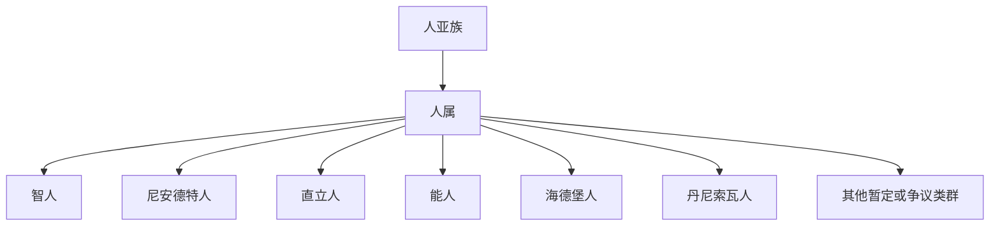

# 人属

## 范围

人属属于人亚族，包含现代人及若干已灭绝或分类地位有争议的古人类成员。

## 概括

人属相关名称包括：智人、尼安德特人、直立人、能人、海德堡人、丹尼索瓦人、长者智人、纳莱迪人、鲁道夫人、格鲁吉亚原人、匠人、豪登人、先驱人、西布兰诺人、罗德西亚人、佛罗勒斯人、吕宋人、澎湖原人、龙人、马鹿洞人、LD 350-1。其中部分名称是物种，有些是化石材料、暂定类群或分类地位有争议的称呼。

## 分类关系

## 代表类群

| 名称 | 说明 |
| --- | --- |
| 智人 | 现代人所属物种 |
| 尼安德特人 | 与现代人近缘的已灭绝古人类 |
| 直立人 | 分布广、延续时间长的古人类类群 |
| 能人 | 常见早期人属成员名称 |
| 海德堡人 | 常用于讨论尼安德特人、现代人等谱系关系的古人类类群 |
| 丹尼索瓦人 | 主要依据古 DNA 和化石材料识别的古人类类群 |
| 长者智人、纳莱迪人、鲁道夫人、格鲁吉亚原人、匠人、豪登人、先驱人、西布兰诺人、罗德西亚人、佛罗勒斯人、吕宋人、澎湖原人、龙人、马鹿洞人、LD 350-1 | 名称清单；其中部分是物种、化石个体、候选分类单元或分类地位有争议的称呼 |

## 说明

- 人属名称清单不等于稳定的直系谱系表。
- 对有争议或暂定的类群，不强行写成确定祖先或后代关系。
- 后续若继续细化古人类，可在人属目录下按物种或化石类群新增独立笔记。

## 上级

- [人亚族](/%E8%87%AA%E7%84%B6%E7%A7%91%E5%AD%A6/%E7%94%9F%E5%91%BD%E7%A7%91%E5%AD%A6/%E7%94%9F%E7%89%A9%E5%88%86%E7%B1%BB%E5%AD%A6/%E5%9F%9F/%E7%9C%9F%E6%A0%B8%E7%94%9F%E7%89%A9%E5%9F%9F/%E5%8A%A8%E7%89%A9%E7%95%8C/%E8%84%8A%E7%B4%A2%E5%8A%A8%E7%89%A9%E9%97%A8/%E8%84%8A%E6%A4%8E%E5%8A%A8%E7%89%A9%E4%BA%9A%E9%97%A8/%E5%93%BA%E4%B9%B3%E7%BA%B2/%E7%81%B5%E9%95%BF%E7%9B%AE/%E7%AE%80%E9%BC%BB%E4%BA%9A%E7%9B%AE/%E7%9C%9F%E7%8C%B4%E4%B8%8B%E7%9B%AE/%E7%8B%AD%E9%BC%BB%E5%B0%8F%E7%9B%AE/%E4%BA%BA%E7%8C%BF%E6%80%BB%E7%A7%91/%E4%BA%BA%E7%A7%91/%E4%BA%BA%E4%BA%9A%E7%A7%91/%E4%BA%BA%E6%97%8F/%E4%BA%BA%E4%BA%9A%E6%97%8F/README.md)
