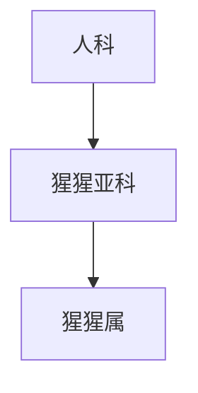

# 猩猩亚科

## 范围

猩猩亚科属于人科，现生代表为猩猩属。

## 概括

猩猩亚科代表亚洲大型猿类分支。下级为猩猩属，包括苏门达腊猩猩、打巴奴里猩猩和婆罗洲猩猩。

## 分类关系

## 说明

- 猩猩属是猩猩亚科的现生代表。
- 猩猩亚科与人亚科并列，不属于人亚科内部。

## 上级

- [人科](/%E8%87%AA%E7%84%B6%E7%A7%91%E5%AD%A6/%E7%94%9F%E5%91%BD%E7%A7%91%E5%AD%A6/%E7%94%9F%E7%89%A9%E5%88%86%E7%B1%BB%E5%AD%A6/%E5%9F%9F/%E7%9C%9F%E6%A0%B8%E7%94%9F%E7%89%A9%E5%9F%9F/%E5%8A%A8%E7%89%A9%E7%95%8C/%E8%84%8A%E7%B4%A2%E5%8A%A8%E7%89%A9%E9%97%A8/%E8%84%8A%E6%A4%8E%E5%8A%A8%E7%89%A9%E4%BA%9A%E9%97%A8/%E5%93%BA%E4%B9%B3%E7%BA%B2/%E7%81%B5%E9%95%BF%E7%9B%AE/%E7%AE%80%E9%BC%BB%E4%BA%9A%E7%9B%AE/%E7%9C%9F%E7%8C%B4%E4%B8%8B%E7%9B%AE/%E7%8B%AD%E9%BC%BB%E5%B0%8F%E7%9B%AE/%E4%BA%BA%E7%8C%BF%E6%80%BB%E7%A7%91/%E4%BA%BA%E7%A7%91/README.md)
