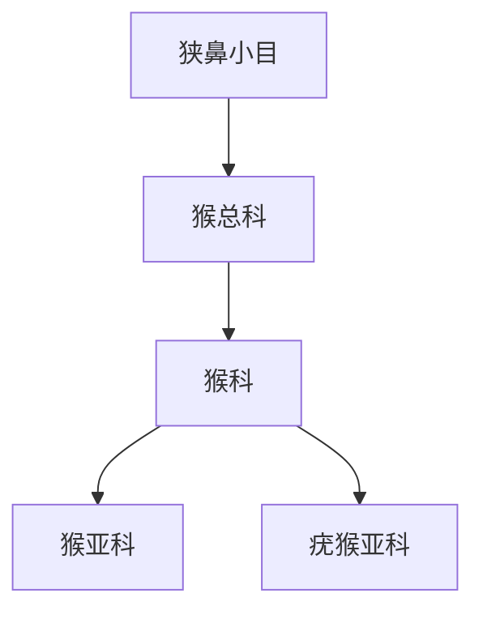

# 猴总科

## 范围

猴总科属于狭鼻小目，主要包括旧大陆猴类。

## 概括

猴总科现生代表通常归入猴科，包含猕猴、狒狒、长尾猴、疣猴、叶猴等类群。它们与人猿总科并列，区别于猿类和人类。

## 分类关系

## 说明

- 猴总科通常有尾，而人猿总科现生类群一般无尾。
- 猴科内部常分为猴亚科和疣猴亚科，食性和消化结构差异明显。

## 上级

- [狭鼻小目](/%E8%87%AA%E7%84%B6%E7%A7%91%E5%AD%A6/%E7%94%9F%E5%91%BD%E7%A7%91%E5%AD%A6/%E7%94%9F%E7%89%A9%E5%88%86%E7%B1%BB%E5%AD%A6/%E5%9F%9F/%E7%9C%9F%E6%A0%B8%E7%94%9F%E7%89%A9%E5%9F%9F/%E5%8A%A8%E7%89%A9%E7%95%8C/%E8%84%8A%E7%B4%A2%E5%8A%A8%E7%89%A9%E9%97%A8/%E8%84%8A%E6%A4%8E%E5%8A%A8%E7%89%A9%E4%BA%9A%E9%97%A8/%E5%93%BA%E4%B9%B3%E7%BA%B2/%E7%81%B5%E9%95%BF%E7%9B%AE/%E7%AE%80%E9%BC%BB%E4%BA%9A%E7%9B%AE/%E7%9C%9F%E7%8C%B4%E4%B8%8B%E7%9B%AE/%E7%8B%AD%E9%BC%BB%E5%B0%8F%E7%9B%AE/README.md)
