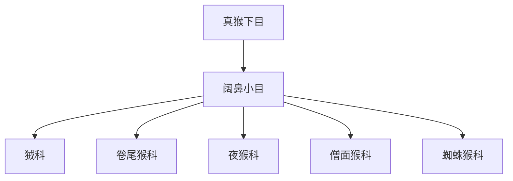

# 阔鼻小目

## 范围

阔鼻小目属于真猴下目，主要对应新大陆猴类。

## 概括

阔鼻小目主要分布在中南美洲，鼻孔较宽且多向侧方开口，尾部形态和生活方式多样。部分类群具有可缠绕尾，适合树栖生活。

## 分类关系

## 说明

- 阔鼻小目与狭鼻小目是现代真猴类的两条主要分支。
- 中文科名和合并口径在不同资料中可能略有差异，本页保留常见导航口径。

## 上级

- [真猴下目](/%E8%87%AA%E7%84%B6%E7%A7%91%E5%AD%A6/%E7%94%9F%E5%91%BD%E7%A7%91%E5%AD%A6/%E7%94%9F%E7%89%A9%E5%88%86%E7%B1%BB%E5%AD%A6/%E5%9F%9F/%E7%9C%9F%E6%A0%B8%E7%94%9F%E7%89%A9%E5%9F%9F/%E5%8A%A8%E7%89%A9%E7%95%8C/%E8%84%8A%E7%B4%A2%E5%8A%A8%E7%89%A9%E9%97%A8/%E8%84%8A%E6%A4%8E%E5%8A%A8%E7%89%A9%E4%BA%9A%E9%97%A8/%E5%93%BA%E4%B9%B3%E7%BA%B2/%E7%81%B5%E9%95%BF%E7%9B%AE/%E7%AE%80%E9%BC%BB%E4%BA%9A%E7%9B%AE/%E7%9C%9F%E7%8C%B4%E4%B8%8B%E7%9B%AE/README.md)
