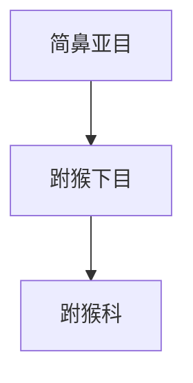

# 跗猴下目

## 范围

跗猴下目属于简鼻亚目，现生代表主要为跗猴科。

## 概括

跗猴类体型小，眼大，后肢和跗骨发达，适合夜间捕食和跳跃。它们与真猴类同属简鼻亚目，但不是猴、猿或人类的直接成员。

## 分类关系

## 说明

- 跗猴类常被用于说明简鼻亚目内部早期分支和真猴类的差异。
- 现生跗猴主要分布在东南亚岛屿和邻近地区。

## 上级

- [简鼻亚目](/%E8%87%AA%E7%84%B6%E7%A7%91%E5%AD%A6/%E7%94%9F%E5%91%BD%E7%A7%91%E5%AD%A6/%E7%94%9F%E7%89%A9%E5%88%86%E7%B1%BB%E5%AD%A6/%E5%9F%9F/%E7%9C%9F%E6%A0%B8%E7%94%9F%E7%89%A9%E5%9F%9F/%E5%8A%A8%E7%89%A9%E7%95%8C/%E8%84%8A%E7%B4%A2%E5%8A%A8%E7%89%A9%E9%97%A8/%E8%84%8A%E6%A4%8E%E5%8A%A8%E7%89%A9%E4%BA%9A%E9%97%A8/%E5%93%BA%E4%B9%B3%E7%BA%B2/%E7%81%B5%E9%95%BF%E7%9B%AE/%E7%AE%80%E9%BC%BB%E4%BA%9A%E7%9B%AE/README.md)
