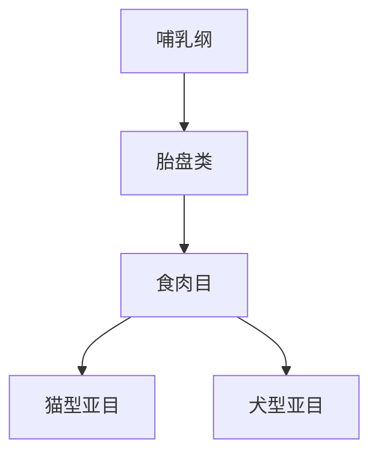

# 食肉目

## 范围

食肉目属于哺乳纲、胎盘类。

## 概括

食肉目包括猫、犬、熊、鼬、灵猫、鬣狗、海豹等类群。许多成员具有明显的捕食和肉食适应，但也有杂食或偏植食的成员。

## 分类关系

## 说明

- 食肉目是分类单元，不等于所有吃肉动物。
- 海豹、海狮等鳍足类通常也放在食肉目内。

## 上级

- [哺乳纲](/%E8%87%AA%E7%84%B6%E7%A7%91%E5%AD%A6/%E7%94%9F%E5%91%BD%E7%A7%91%E5%AD%A6/%E7%94%9F%E7%89%A9%E5%88%86%E7%B1%BB%E5%AD%A6/%E5%9F%9F/%E7%9C%9F%E6%A0%B8%E7%94%9F%E7%89%A9%E5%9F%9F/%E5%8A%A8%E7%89%A9%E7%95%8C/%E8%84%8A%E7%B4%A2%E5%8A%A8%E7%89%A9%E9%97%A8/%E8%84%8A%E6%A4%8E%E5%8A%A8%E7%89%A9%E4%BA%9A%E9%97%A8/%E5%93%BA%E4%B9%B3%E7%BA%B2/README.md)
