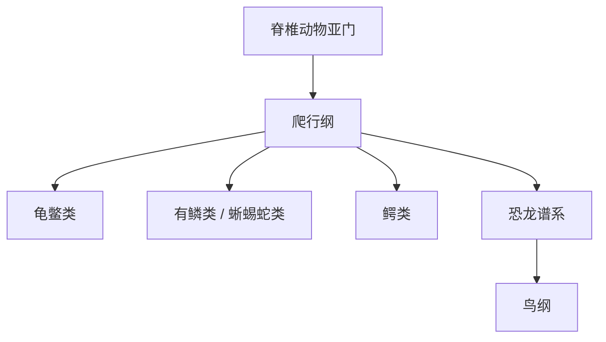

# 爬行纲

## 范围

爬行纲属于脊椎动物亚门，是传统分类中一类以羊膜卵、角质鳞片和陆地适应为重要特征的脊椎动物。

## 概括

爬行纲通常包括龟鳖类、有鳞类和鳄类等。传统分类常把鸟纲与爬行纲并列，但按系统发育关系，鸟类来自恐龙谱系，嵌套在爬行动物演化支中。

## 分类关系

## 说明

- 代表类群包括龟、蜥蜴、蛇和鳄。
- “爬行纲”作为传统分类入口有实用性，但若排除鸟类则不是严格单系类群。
- 爬行类、鸟类和哺乳类都属于羊膜动物相关讨论中的重要分支。

## 上级

- [脊椎动物亚门](/%E8%87%AA%E7%84%B6%E7%A7%91%E5%AD%A6/%E7%94%9F%E5%91%BD%E7%A7%91%E5%AD%A6/%E7%94%9F%E7%89%A9%E5%88%86%E7%B1%BB%E5%AD%A6/%E5%9F%9F/%E7%9C%9F%E6%A0%B8%E7%94%9F%E7%89%A9%E5%9F%9F/%E5%8A%A8%E7%89%A9%E7%95%8C/%E8%84%8A%E7%B4%A2%E5%8A%A8%E7%89%A9%E9%97%A8/%E8%84%8A%E6%A4%8E%E5%8A%A8%E7%89%A9%E4%BA%9A%E9%97%A8/README.md)
