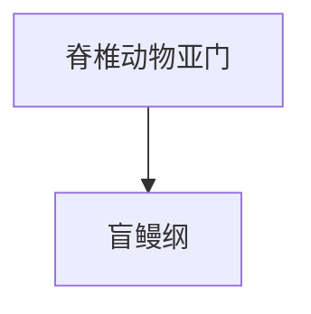

# 盲鳗纲

## 范围

盲鳗纲属于脊椎动物亚门，是现生无颌类脊椎动物的一支。

## 概括

盲鳗身体细长，缺少真正颌，通常生活在海洋环境中。它们与七鳃鳗常被合称为圆口类，但在不同分类体系中二者可被拆成不同纲或合并处理。

## 分类关系

## 说明

- 代表类群为盲鳗。
- 盲鳗没有真正颌，身体结构保留许多基干脊椎动物特征。
- 盲鳗是否应严格列入 Vertebrata 或更广义的 Craniata，在一些体系中有不同处理；本目录按常见学习分类列入脊椎动物亚门。

## 上级

- [脊椎动物亚门](/%E8%87%AA%E7%84%B6%E7%A7%91%E5%AD%A6/%E7%94%9F%E5%91%BD%E7%A7%91%E5%AD%A6/%E7%94%9F%E7%89%A9%E5%88%86%E7%B1%BB%E5%AD%A6/%E5%9F%9F/%E7%9C%9F%E6%A0%B8%E7%94%9F%E7%89%A9%E5%9F%9F/%E5%8A%A8%E7%89%A9%E7%95%8C/%E8%84%8A%E7%B4%A2%E5%8A%A8%E7%89%A9%E9%97%A8/%E8%84%8A%E6%A4%8E%E5%8A%A8%E7%89%A9%E4%BA%9A%E9%97%A8/README.md)
