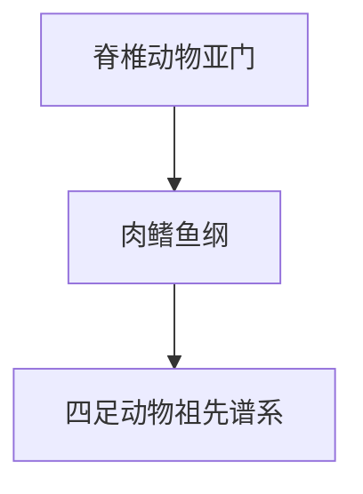

# 肉鳍鱼纲

## 范围

肉鳍鱼纲属于脊椎动物亚门，是硬骨鱼类中的一支。

## 概括

肉鳍鱼纲包括肺鱼和腔棘鱼等现生类群。其偶鳍具有肉质叶状结构，在脊椎动物演化中与四足动物肢体起源关系密切。

## 分类关系

## 说明

- 现生代表包括肺鱼和腔棘鱼。
- 肉鳍鱼纲与四足动物起源关系密切；若按严格系统发育，四足动物可视为肉鳍鱼谱系中的后裔。
- 作为学习目录，本笔记暂把肉鳍鱼纲作为鱼类形态入口，不把两栖纲、爬行纲、鸟纲、哺乳纲嵌入其下。

## 上级

- [脊椎动物亚门](/%E8%87%AA%E7%84%B6%E7%A7%91%E5%AD%A6/%E7%94%9F%E5%91%BD%E7%A7%91%E5%AD%A6/%E7%94%9F%E7%89%A9%E5%88%86%E7%B1%BB%E5%AD%A6/%E5%9F%9F/%E7%9C%9F%E6%A0%B8%E7%94%9F%E7%89%A9%E5%9F%9F/%E5%8A%A8%E7%89%A9%E7%95%8C/%E8%84%8A%E7%B4%A2%E5%8A%A8%E7%89%A9%E9%97%A8/%E8%84%8A%E6%A4%8E%E5%8A%A8%E7%89%A9%E4%BA%9A%E9%97%A8/README.md)
