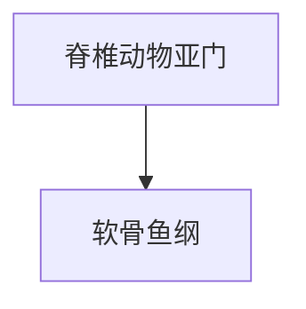

# 软骨鱼纲

## 范围

软骨鱼纲属于脊椎动物亚门，是有颌鱼类中的一支。

## 概括

软骨鱼纲包括鲨、鳐、魟和银鲛等。它们的骨骼主要由软骨构成，而不是像多数硬骨鱼那样高度骨化。

## 分类关系

## 说明

- 鲨类、鳐类和魟类是常见代表。
- 软骨鱼属于有颌脊椎动物，与无颌的盲鳗、七鳃鳗不同。
- “软骨鱼”不是指身体柔软，而是指骨骼系统以软骨为主。

## 上级

- [脊椎动物亚门](/%E8%87%AA%E7%84%B6%E7%A7%91%E5%AD%A6/%E7%94%9F%E5%91%BD%E7%A7%91%E5%AD%A6/%E7%94%9F%E7%89%A9%E5%88%86%E7%B1%BB%E5%AD%A6/%E5%9F%9F/%E7%9C%9F%E6%A0%B8%E7%94%9F%E7%89%A9%E5%9F%9F/%E5%8A%A8%E7%89%A9%E7%95%8C/%E8%84%8A%E7%B4%A2%E5%8A%A8%E7%89%A9%E9%97%A8/%E8%84%8A%E6%A4%8E%E5%8A%A8%E7%89%A9%E4%BA%9A%E9%97%A8/README.md)
