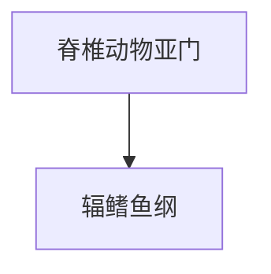

# 辐鳍鱼纲

## 范围

辐鳍鱼纲属于脊椎动物亚门，是硬骨鱼类中最庞大的一支。

## 概括

辐鳍鱼纲包括绝大多数常见鱼类。其鳍主要由鳍条支撑，和肉鳍鱼纲的肉质叶状偶鳍不同。

## 分类关系

## 说明

- 许多日常所说的淡水鱼和海水鱼都属于辐鳍鱼纲。
- 辐鳍鱼纲是现生脊椎动物中物种数极多的类群。
- 与肉鳍鱼纲相比，辐鳍鱼纲通常没有与四足动物肢体同源关系更直接的肉质偶鳍结构。

## 上级

- [脊椎动物亚门](/%E8%87%AA%E7%84%B6%E7%A7%91%E5%AD%A6/%E7%94%9F%E5%91%BD%E7%A7%91%E5%AD%A6/%E7%94%9F%E7%89%A9%E5%88%86%E7%B1%BB%E5%AD%A6/%E5%9F%9F/%E7%9C%9F%E6%A0%B8%E7%94%9F%E7%89%A9%E5%9F%9F/%E5%8A%A8%E7%89%A9%E7%95%8C/%E8%84%8A%E7%B4%A2%E5%8A%A8%E7%89%A9%E9%97%A8/%E8%84%8A%E6%A4%8E%E5%8A%A8%E7%89%A9%E4%BA%9A%E9%97%A8/README.md)
