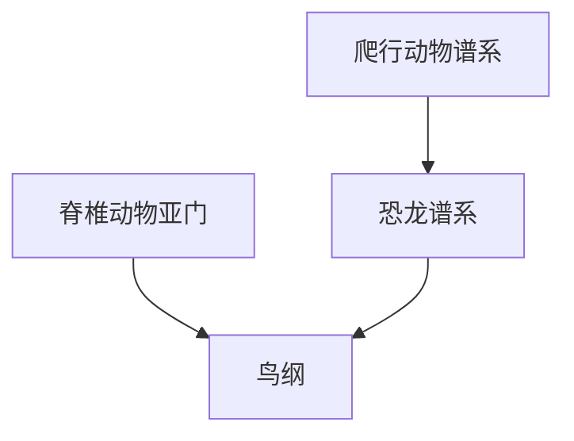

# 鸟纲

## 范围

鸟纲属于脊椎动物亚门，是一类具有羽毛、喙和高度特化身体结构的羊膜动物。

## 概括

鸟类具有羽毛、前肢特化为翼，多数具有飞行能力，也有失去飞行能力的类群。演化上，鸟类来自兽脚类恐龙谱系。

## 分类关系

## 说明

- 羽毛是鸟类最关键的识别特征之一。
- 鸟类与爬行类在传统分类中常并列，但在演化关系上鸟类嵌套于恐龙谱系。
- 鸟类的骨骼、呼吸系统和代谢方式与飞行适应密切相关。

## 上级

- [脊椎动物亚门](/%E8%87%AA%E7%84%B6%E7%A7%91%E5%AD%A6/%E7%94%9F%E5%91%BD%E7%A7%91%E5%AD%A6/%E7%94%9F%E7%89%A9%E5%88%86%E7%B1%BB%E5%AD%A6/%E5%9F%9F/%E7%9C%9F%E6%A0%B8%E7%94%9F%E7%89%A9%E5%9F%9F/%E5%8A%A8%E7%89%A9%E7%95%8C/%E8%84%8A%E7%B4%A2%E5%8A%A8%E7%89%A9%E9%97%A8/%E8%84%8A%E6%A4%8E%E5%8A%A8%E7%89%A9%E4%BA%9A%E9%97%A8/README.md)
