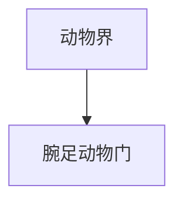

# 腕足动物门

## 范围

腕足动物门属于动物界，常见代表为腕足类。

## 概括

腕足动物通常具有两片壳，外形容易与双壳类软体动物混淆，但二者身体结构和亲缘关系不同。腕足动物在古生代海洋中曾非常繁盛。

## 分类关系

## 说明

- 外壳通常为背腹两瓣，而双壳类软体动物多为左右两瓣。
- 多数营海生固着生活。
- 化石记录丰富，是古生物学中常见类群。

## 上级

- [动物界](/%E8%87%AA%E7%84%B6%E7%A7%91%E5%AD%A6/%E7%94%9F%E5%91%BD%E7%A7%91%E5%AD%A6/%E7%94%9F%E7%89%A9%E5%88%86%E7%B1%BB%E5%AD%A6/%E5%9F%9F/%E7%9C%9F%E6%A0%B8%E7%94%9F%E7%89%A9%E5%9F%9F/%E5%8A%A8%E7%89%A9%E7%95%8C/README.md)
