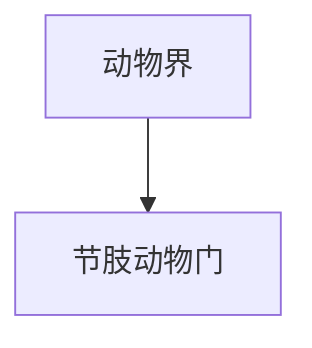

# 节肢动物门

## 范围

节肢动物门属于动物界，常见代表包括昆虫、蜘蛛、甲壳类、蜈蚣和马陆等。

## 概括

节肢动物具有分节身体、外骨骼和分节附肢，是现生动物中物种数最多的门。它们在陆地、淡水和海洋生态系统中都非常重要。

## 分类关系

## 说明

- 昆虫是节肢动物中物种极多的一支。
- 蜘蛛、蝎等属于螯肢动物类群。
- 虾、蟹等甲壳类多见于水生环境。
- 外骨骼提供保护和支撑，但生长过程中需要蜕皮。

## 上级

- [动物界](/%E8%87%AA%E7%84%B6%E7%A7%91%E5%AD%A6/%E7%94%9F%E5%91%BD%E7%A7%91%E5%AD%A6/%E7%94%9F%E7%89%A9%E5%88%86%E7%B1%BB%E5%AD%A6/%E5%9F%9F/%E7%9C%9F%E6%A0%B8%E7%94%9F%E7%89%A9%E5%9F%9F/%E5%8A%A8%E7%89%A9%E7%95%8C/README.md)
