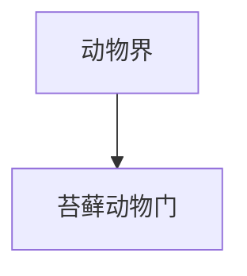

# 苔藓动物门

## 范围

苔藓动物门属于动物界，常见代表为苔藓虫。

## 概括

苔藓动物多为水生群体动物，个体小，常形成附着在基质上的群体结构。名称中的“苔藓”容易误导，它们不是植物中的苔藓。

## 分类关系

## 说明

- 多数营固着生活。
- 通过触手冠滤食水中的微小颗粒。
- 与腕足动物等类群都常被放在触手冠动物相关讨论中。

## 上级

- [动物界](/%E8%87%AA%E7%84%B6%E7%A7%91%E5%AD%A6/%E7%94%9F%E5%91%BD%E7%A7%91%E5%AD%A6/%E7%94%9F%E7%89%A9%E5%88%86%E7%B1%BB%E5%AD%A6/%E5%9F%9F/%E7%9C%9F%E6%A0%B8%E7%94%9F%E7%89%A9%E5%9F%9F/%E5%8A%A8%E7%89%A9%E7%95%8C/README.md)
