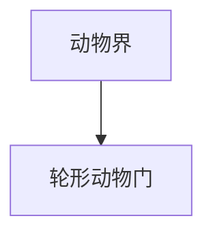

# 轮形动物门

## 范围

轮形动物门属于动物界，常见代表为轮虫。

## 概括

轮形动物多为小型水生或湿润环境中的动物，头部常有轮盘状纤毛结构，用于运动和取食。

## 分类关系

## 说明

- 常见于淡水环境，也可见于潮湿土壤或苔藓间隙。
- 体型微小，但具有消化、生殖等较完整的器官系统。
- 一些轮虫类群以特殊生殖方式和耐受干燥能力著称。

## 上级

- [动物界](/%E8%87%AA%E7%84%B6%E7%A7%91%E5%AD%A6/%E7%94%9F%E5%91%BD%E7%A7%91%E5%AD%A6/%E7%94%9F%E7%89%A9%E5%88%86%E7%B1%BB%E5%AD%A6/%E5%9F%9F/%E7%9C%9F%E6%A0%B8%E7%94%9F%E7%89%A9%E5%9F%9F/%E5%8A%A8%E7%89%A9%E7%95%8C/README.md)
