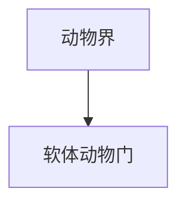

# 软体动物门

## 范围

软体动物门属于动物界，常见代表包括蜗牛、贝类、章鱼和乌贼等。

## 概括

软体动物通常具有外套膜、足和内脏团，许多类群具有贝壳。该门物种多样，生活环境包括海洋、淡水和陆地。

## 分类关系

## 说明

- 腹足类包括蜗牛、蛞蝓等。
- 双壳类包括蛤、蚌、牡蛎等。
- 头足类包括章鱼、乌贼、鹦鹉螺等，神经系统较发达。

## 上级

- [动物界](/%E8%87%AA%E7%84%B6%E7%A7%91%E5%AD%A6/%E7%94%9F%E5%91%BD%E7%A7%91%E5%AD%A6/%E7%94%9F%E7%89%A9%E5%88%86%E7%B1%BB%E5%AD%A6/%E5%9F%9F/%E7%9C%9F%E6%A0%B8%E7%94%9F%E7%89%A9%E5%9F%9F/%E5%8A%A8%E7%89%A9%E7%95%8C/README.md)
