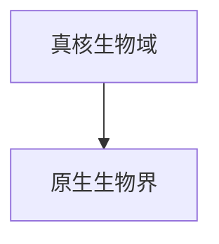

# 原生生物界

## 范围

原生生物界属于真核生物域，是传统分类中用于容纳不属于动物界、植物界、真菌界的多种真核生物的集合。

## 概括

原生生物包括许多单细胞真核生物，也可能包括一些简单多细胞或群体性真核生物。它们在形态、营养方式和演化关系上差异很大，因此“原生生物界”更适合作为学习和整理入口，而不是严格的单系自然类群。

## 分类关系

## 说明

- 本笔记只作为原生生物界入口，不继续展开下级分类。
- 原生生物界是传统便利类群，现代系统发育分类会把相关生物分散到多个真核大类群中。
- 藻类、原生动物等名称常与原生生物相关，但这些名称本身也可能不是严格单系类群。

## 上级

- [真核生物域](/%E8%87%AA%E7%84%B6%E7%A7%91%E5%AD%A6/%E7%94%9F%E5%91%BD%E7%A7%91%E5%AD%A6/%E7%94%9F%E7%89%A9%E5%88%86%E7%B1%BB%E5%AD%A6/%E5%9F%9F/%E7%9C%9F%E6%A0%B8%E7%94%9F%E7%89%A9%E5%9F%9F/README.md)
