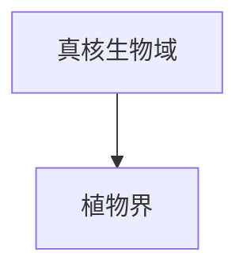

# 植物界

## 范围

植物界属于真核生物域，是以光合作用为重要特征的真核生物类群。常见植物包括苔藓类、蕨类、裸子植物和被子植物等。

## 概括

植物通常具有叶绿体，能通过光合作用把光能转化为有机物中的化学能。植物界的边界在不同分类体系中可能有差异，尤其是藻类是否纳入植物界的问题。

## 分类关系

## 说明

- 本笔记只作为植物界入口，不继续展开下级分类。
- “植物”在日常语境和系统分类语境中边界不完全相同。
- 后续若整理植物分类，可再按主要演化支或传统门类逐级展开。

## 上级

- [真核生物域](/%E8%87%AA%E7%84%B6%E7%A7%91%E5%AD%A6/%E7%94%9F%E5%91%BD%E7%A7%91%E5%AD%A6/%E7%94%9F%E7%89%A9%E5%88%86%E7%B1%BB%E5%AD%A6/%E5%9F%9F/%E7%9C%9F%E6%A0%B8%E7%94%9F%E7%89%A9%E5%9F%9F/README.md)
