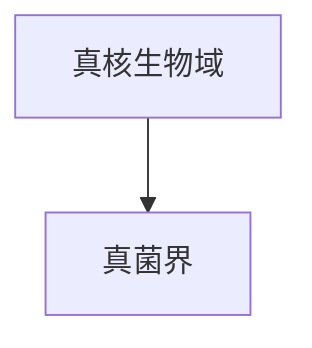

# 真菌界

## 范围

真菌界属于真核生物域，包括蘑菇、霉菌、酵母等多种真核生物。

## 概括

真菌通常以吸收方式获取营养，许多真菌具有由菌丝构成的结构，并在生态系统中承担分解者、共生者或寄生者等角色。真菌不是植物，虽然传统分类中曾长期与植物放在一起讨论。

## 分类关系

## 说明

- 本笔记只作为真菌界入口，不继续展开下级分类。
- 真菌与动物同属后鞭毛生物相关谱系，和植物的关系并不比和动物更近。
- 后续若整理真菌分类，可再按主要门类和生活型展开。

## 上级

- [真核生物域](/%E8%87%AA%E7%84%B6%E7%A7%91%E5%AD%A6/%E7%94%9F%E5%91%BD%E7%A7%91%E5%AD%A6/%E7%94%9F%E7%89%A9%E5%88%86%E7%B1%BB%E5%AD%A6/%E5%9F%9F/%E7%9C%9F%E6%A0%B8%E7%94%9F%E7%89%A9%E5%9F%9F/README.md)
