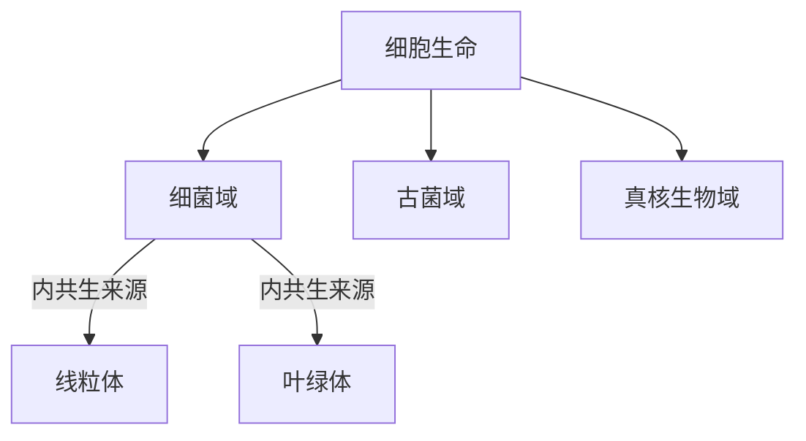

# 细菌域

## 范围

细菌域是一大类原核生物。细菌没有细胞核，通常也没有由膜包裹的复杂细胞器，是细胞生命三域系统中的一个域。

## 概括

细菌是生物中数量极多、分布极广的一类。过去细菌曾与古菌一起被归入“原核生物界”，但现代分类通常把细菌和古菌区分为两个域。

## 分类关系

## 说明

- 细菌是非常古老的生物，原笔记记录其大约出现于 37 亿年前。
- 原笔记记录细菌数量估计约为 `5×10^30` 个，用于强调其数量巨大和生态分布广泛。
- 真核细胞中的线粒体和叶绿体通常被认为来源于内共生细菌。
- “细菌”与“古菌”都属于无细胞核的原核型细胞生命，但二者不是同一类群。

## 上级

- [域](/%E8%87%AA%E7%84%B6%E7%A7%91%E5%AD%A6/%E7%94%9F%E5%91%BD%E7%A7%91%E5%AD%A6/%E7%94%9F%E7%89%A9%E5%88%86%E7%B1%BB%E5%AD%A6/%E5%9F%9F/README.md)
