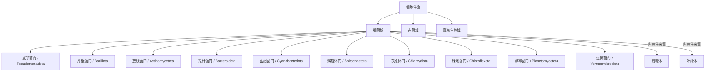

# 细菌域

## 范围

细菌域是一大类原核生物。细菌没有细胞核，通常也没有由膜包裹的复杂细胞器，是细胞生命三域系统中的一个域。

## 概括

细菌是生物中数量极多、分布极广的一类。过去细菌曾与古菌一起被归入“原核生物界”，但现代分类通常把细菌和古菌区分为两个域。

细菌域内部的门级分类近年有较多命名调整。许多资料仍使用旧名，例如 Proteobacteria、Firmicutes、Bacteroidetes；较新的命名中常对应为 Pseudomonadota、Bacillota、Bacteroidota。本目录用中文常用名作为目录名，并在表格中列出现行拉丁名和旧名。

## 分类关系

## 主要门级入口

| 中文名 | 现行拉丁名 | 常见旧名 / 说明 | 链接 |
| --- | --- | --- | --- |
| 变形菌门 | Pseudomonadota | 常见旧名 Proteobacteria；包含大量革兰氏阴性细菌 | [变形菌门](/%E8%87%AA%E7%84%B6%E7%A7%91%E5%AD%A6/%E7%94%9F%E5%91%BD%E7%A7%91%E5%AD%A6/%E7%94%9F%E7%89%A9%E5%88%86%E7%B1%BB%E5%AD%A6/%E5%9F%9F/%E7%BB%86%E8%8F%8C%E5%9F%9F/%E5%8F%98%E5%BD%A2%E8%8F%8C%E9%97%A8/README.md) |
| 厚壁菌门 | Bacillota | 常见旧名 Firmicutes；许多成员为低 G+C 革兰氏阳性细菌 | [厚壁菌门](/%E8%87%AA%E7%84%B6%E7%A7%91%E5%AD%A6/%E7%94%9F%E5%91%BD%E7%A7%91%E5%AD%A6/%E7%94%9F%E7%89%A9%E5%88%86%E7%B1%BB%E5%AD%A6/%E5%9F%9F/%E7%BB%86%E8%8F%8C%E5%9F%9F/%E5%8E%9A%E5%A3%81%E8%8F%8C%E9%97%A8/README.md) |
| 放线菌门 | Actinomycetota | 常见旧名 Actinobacteria；高 G+C 革兰氏阳性细菌 | [放线菌门](/%E8%87%AA%E7%84%B6%E7%A7%91%E5%AD%A6/%E7%94%9F%E5%91%BD%E7%A7%91%E5%AD%A6/%E7%94%9F%E7%89%A9%E5%88%86%E7%B1%BB%E5%AD%A6/%E5%9F%9F/%E7%BB%86%E8%8F%8C%E5%9F%9F/%E6%94%BE%E7%BA%BF%E8%8F%8C%E9%97%A8/README.md) |
| 拟杆菌门 | Bacteroidota | 常见旧名 Bacteroidetes；常见于环境和动物肠道微生物群 | [拟杆菌门](/%E8%87%AA%E7%84%B6%E7%A7%91%E5%AD%A6/%E7%94%9F%E5%91%BD%E7%A7%91%E5%AD%A6/%E7%94%9F%E7%89%A9%E5%88%86%E7%B1%BB%E5%AD%A6/%E5%9F%9F/%E7%BB%86%E8%8F%8C%E5%9F%9F/%E6%8B%9F%E6%9D%86%E8%8F%8C%E9%97%A8/README.md) |
| 蓝细菌门 | Cyanobacteriota | 常见名 Cyanobacteria；能进行产氧光合作用 | [蓝细菌门](/%E8%87%AA%E7%84%B6%E7%A7%91%E5%AD%A6/%E7%94%9F%E5%91%BD%E7%A7%91%E5%AD%A6/%E7%94%9F%E7%89%A9%E5%88%86%E7%B1%BB%E5%AD%A6/%E5%9F%9F/%E7%BB%86%E8%8F%8C%E5%9F%9F/%E8%93%9D%E7%BB%86%E8%8F%8C%E9%97%A8/README.md) |
| 螺旋体门 | Spirochaetota | 细长螺旋形细菌，运动方式特殊 | [螺旋体门](/%E8%87%AA%E7%84%B6%E7%A7%91%E5%AD%A6/%E7%94%9F%E5%91%BD%E7%A7%91%E5%AD%A6/%E7%94%9F%E7%89%A9%E5%88%86%E7%B1%BB%E5%AD%A6/%E5%9F%9F/%E7%BB%86%E8%8F%8C%E5%9F%9F/%E8%9E%BA%E6%97%8B%E4%BD%93%E9%97%A8/README.md) |
| 衣原体门 | Chlamydiota | 多数为细胞内寄生或共生相关细菌 | [衣原体门](/%E8%87%AA%E7%84%B6%E7%A7%91%E5%AD%A6/%E7%94%9F%E5%91%BD%E7%A7%91%E5%AD%A6/%E7%94%9F%E7%89%A9%E5%88%86%E7%B1%BB%E5%AD%A6/%E5%9F%9F/%E7%BB%86%E8%8F%8C%E5%9F%9F/%E8%A1%A3%E5%8E%9F%E4%BD%93%E9%97%A8/README.md) |
| 绿弯菌门 | Chloroflexota | 包含多种光合或环境细菌 | [绿弯菌门](/%E8%87%AA%E7%84%B6%E7%A7%91%E5%AD%A6/%E7%94%9F%E5%91%BD%E7%A7%91%E5%AD%A6/%E7%94%9F%E7%89%A9%E5%88%86%E7%B1%BB%E5%AD%A6/%E5%9F%9F/%E7%BB%86%E8%8F%8C%E5%9F%9F/%E7%BB%BF%E5%BC%AF%E8%8F%8C%E9%97%A8/README.md) |
| 浮霉菌门 | Planctomycetota | 细胞结构和生活史较特殊的一类细菌 | [浮霉菌门](/%E8%87%AA%E7%84%B6%E7%A7%91%E5%AD%A6/%E7%94%9F%E5%91%BD%E7%A7%91%E5%AD%A6/%E7%94%9F%E7%89%A9%E5%88%86%E7%B1%BB%E5%AD%A6/%E5%9F%9F/%E7%BB%86%E8%8F%8C%E5%9F%9F/%E6%B5%AE%E9%9C%89%E8%8F%8C%E9%97%A8/README.md) |
| 疣微菌门 | Verrucomicrobiota | 环境和宿主相关微生物群中常见 | [疣微菌门](/%E8%87%AA%E7%84%B6%E7%A7%91%E5%AD%A6/%E7%94%9F%E5%91%BD%E7%A7%91%E5%AD%A6/%E7%94%9F%E7%89%A9%E5%88%86%E7%B1%BB%E5%AD%A6/%E5%9F%9F/%E7%BB%86%E8%8F%8C%E5%9F%9F/%E7%96%A3%E5%BE%AE%E8%8F%8C%E9%97%A8/README.md) |

## 说明

- 细菌是非常古老的生物，原笔记记录其大约出现于 37 亿年前。
- 原笔记记录细菌数量估计约为 `5×10^30` 个，用于强调其数量巨大和生态分布广泛。
- 真核细胞中的线粒体和叶绿体通常被认为来源于内共生细菌。
- “细菌”与“古菌”都属于无细胞核的原核型细胞生命，但二者不是同一类群。
- 本目录只建立细菌域下的门级子层；具体纲、目、科、属、种暂不展开。

## 上级

- [域](/%E8%87%AA%E7%84%B6%E7%A7%91%E5%AD%A6/%E7%94%9F%E5%91%BD%E7%A7%91%E5%AD%A6/%E7%94%9F%E7%89%A9%E5%88%86%E7%B1%BB%E5%AD%A6/%E5%9F%9F/README.md)
