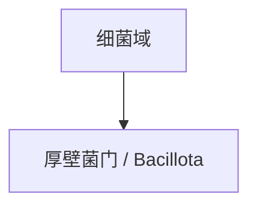

# 厚壁菌门

## 范围

厚壁菌门属于细菌域，现行拉丁名常写作 Bacillota，常见旧名为 Firmicutes。

## 概括

厚壁菌门包含许多低 G+C 革兰氏阳性细菌，其中一些类群能形成芽孢，也包括大量与土壤、发酵、肠道微生物群和病原相关的细菌。

## 分类关系

## 说明

- 本笔记只作为门级入口，不继续展开下级分类。
- 阅读旧资料时，Firmicutes 通常对应这里的厚壁菌门。

## 上级

- [细菌域](/%E8%87%AA%E7%84%B6%E7%A7%91%E5%AD%A6/%E7%94%9F%E5%91%BD%E7%A7%91%E5%AD%A6/%E7%94%9F%E7%89%A9%E5%88%86%E7%B1%BB%E5%AD%A6/%E5%9F%9F/%E7%BB%86%E8%8F%8C%E5%9F%9F/README.md)
