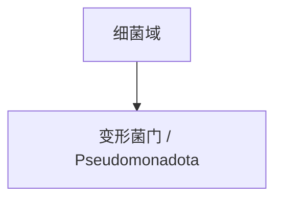

# 变形菌门

## 范围

变形菌门属于细菌域，现行拉丁名常写作 Pseudomonadota，常见旧名为 Proteobacteria。

## 概括

变形菌门包含大量革兰氏阴性细菌，生态位非常广，包括自由生活、共生、病原、光合和化能营养等多种类型。

## 分类关系

## 说明

- 本笔记只作为门级入口，不继续展开下级分类。
- 阅读旧资料时，Proteobacteria 通常对应这里的变形菌门。

## 上级

- [细菌域](/%E8%87%AA%E7%84%B6%E7%A7%91%E5%AD%A6/%E7%94%9F%E5%91%BD%E7%A7%91%E5%AD%A6/%E7%94%9F%E7%89%A9%E5%88%86%E7%B1%BB%E5%AD%A6/%E5%9F%9F/%E7%BB%86%E8%8F%8C%E5%9F%9F/README.md)
