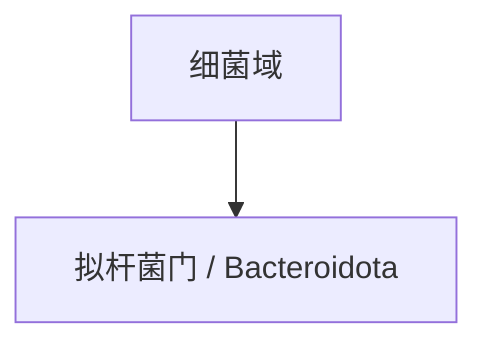

# 拟杆菌门

## 范围

拟杆菌门属于细菌域，现行拉丁名常写作 Bacteroidota，常见旧名为 Bacteroidetes。

## 概括

拟杆菌门成员广泛存在于土壤、水体和动物肠道等环境中，许多类群擅长分解复杂有机物。

## 分类关系

## 说明

- 本笔记只作为门级入口，不继续展开下级分类。
- 阅读旧资料时，Bacteroidetes 通常对应这里的拟杆菌门。

## 上级

- [细菌域](/%E8%87%AA%E7%84%B6%E7%A7%91%E5%AD%A6/%E7%94%9F%E5%91%BD%E7%A7%91%E5%AD%A6/%E7%94%9F%E7%89%A9%E5%88%86%E7%B1%BB%E5%AD%A6/%E5%9F%9F/%E7%BB%86%E8%8F%8C%E5%9F%9F/README.md)
