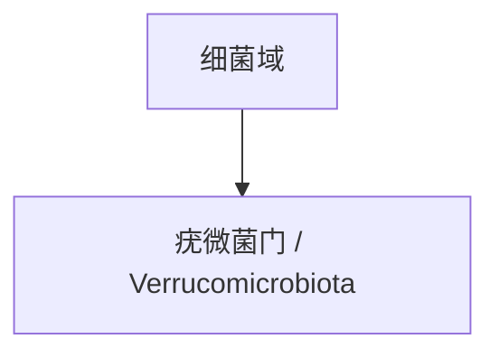

# 疣微菌门

## 范围

疣微菌门属于细菌域，现行拉丁名常写作 Verrucomicrobiota。

## 概括

疣微菌门成员广泛存在于土壤、水体和宿主相关微生物群中。部分成员在肠道微生物群和环境微生物研究中较常出现。

## 分类关系

## 说明

- 本笔记只作为门级入口，不继续展开下级分类。
- 疣微菌门是环境和宿主相关微生物群中的重要门级入口之一。

## 上级

- [细菌域](/%E8%87%AA%E7%84%B6%E7%A7%91%E5%AD%A6/%E7%94%9F%E5%91%BD%E7%A7%91%E5%AD%A6/%E7%94%9F%E7%89%A9%E5%88%86%E7%B1%BB%E5%AD%A6/%E5%9F%9F/%E7%BB%86%E8%8F%8C%E5%9F%9F/README.md)
