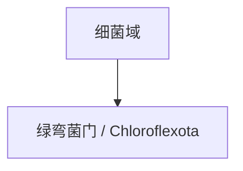

# 绿弯菌门

## 范围

绿弯菌门属于细菌域，现行拉丁名常写作 Chloroflexota。

## 概括

绿弯菌门包含多种环境细菌，其中一些成员具有光合能力或与复杂环境代谢过程有关。

## 分类关系

## 说明

- 本笔记只作为门级入口，不继续展开下级分类。
- 绿弯菌门成员生态类型多样，不应只按名称理解为单一“绿色细菌”。

## 上级

- [细菌域](/%E8%87%AA%E7%84%B6%E7%A7%91%E5%AD%A6/%E7%94%9F%E5%91%BD%E7%A7%91%E5%AD%A6/%E7%94%9F%E7%89%A9%E5%88%86%E7%B1%BB%E5%AD%A6/%E5%9F%9F/%E7%BB%86%E8%8F%8C%E5%9F%9F/README.md)
