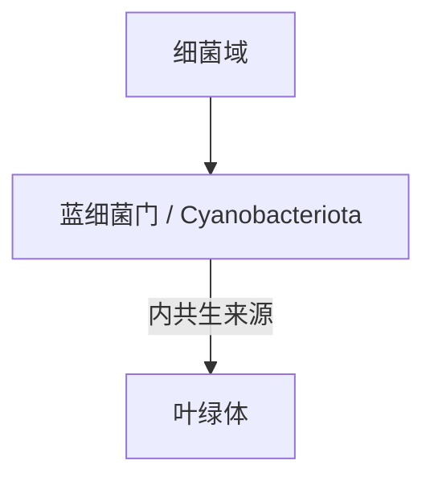

# 蓝细菌门

## 范围

蓝细菌门属于细菌域，现行拉丁名常写作 Cyanobacteriota，常见名为 Cyanobacteria。

## 概括

蓝细菌能够进行产氧光合作用，是地球早期氧气积累和生态系统演化中的关键类群。真核植物和藻类的叶绿体通常被认为来源于蓝细菌内共生事件。

## 分类关系

## 说明

- 本笔记只作为门级入口，不继续展开下级分类。
- 蓝细菌不是藻类，虽然传统上曾被称作“蓝藻”。

## 上级

- [细菌域](/%E8%87%AA%E7%84%B6%E7%A7%91%E5%AD%A6/%E7%94%9F%E5%91%BD%E7%A7%91%E5%AD%A6/%E7%94%9F%E7%89%A9%E5%88%86%E7%B1%BB%E5%AD%A6/%E5%9F%9F/%E7%BB%86%E8%8F%8C%E5%9F%9F/README.md)
