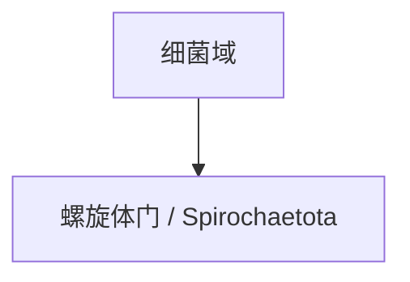

# 螺旋体门

## 范围

螺旋体门属于细菌域，现行拉丁名常写作 Spirochaetota。

## 概括

螺旋体门成员通常具有细长、螺旋状的细胞形态和特殊运动方式。该门中既有自由生活类型，也有与动物宿主和疾病相关的类型。

## 分类关系

## 说明

- 本笔记只作为门级入口，不继续展开下级分类。
- “螺旋体”强调形态和运动特征，但具体类群仍需按系统分类判断。

## 上级

- [细菌域](/%E8%87%AA%E7%84%B6%E7%A7%91%E5%AD%A6/%E7%94%9F%E5%91%BD%E7%A7%91%E5%AD%A6/%E7%94%9F%E7%89%A9%E5%88%86%E7%B1%BB%E5%AD%A6/%E5%9F%9F/%E7%BB%86%E8%8F%8C%E5%9F%9F/README.md)
